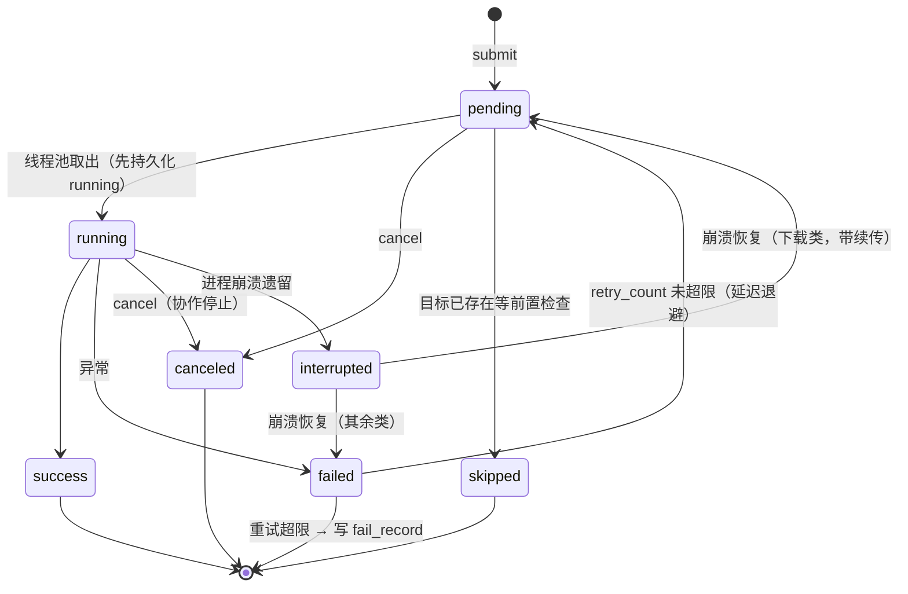
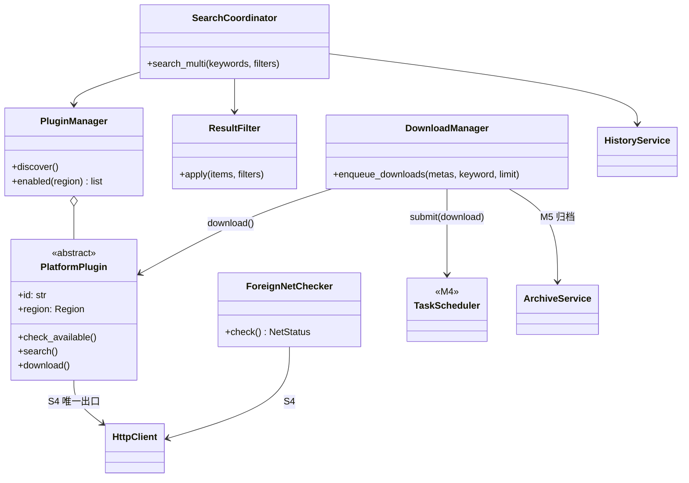
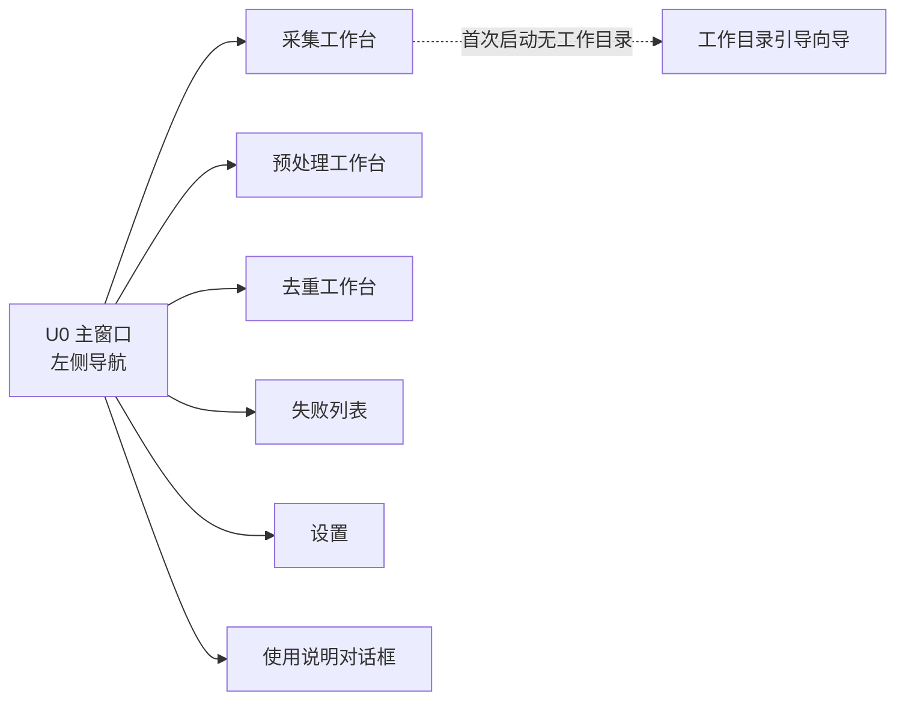
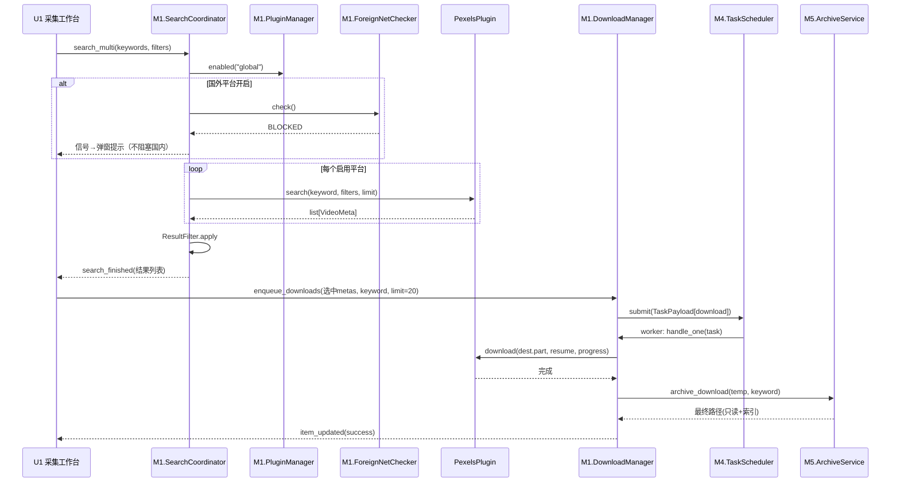
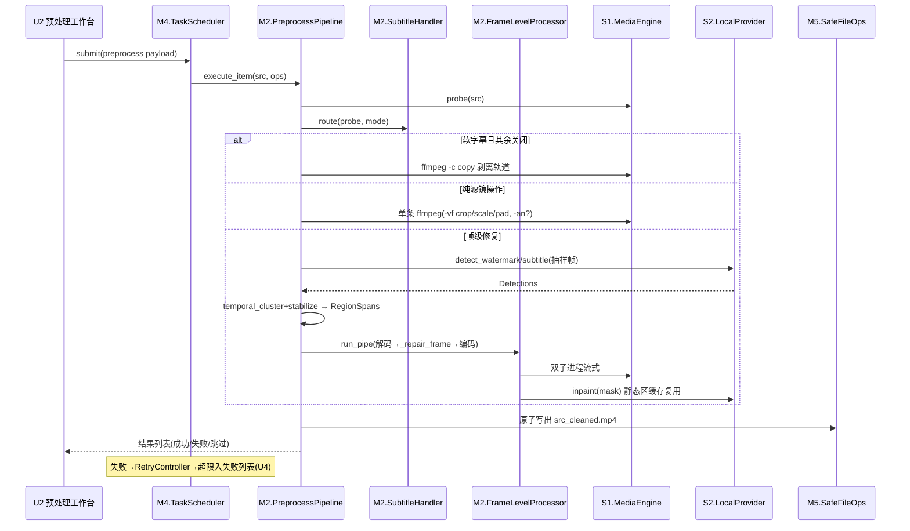
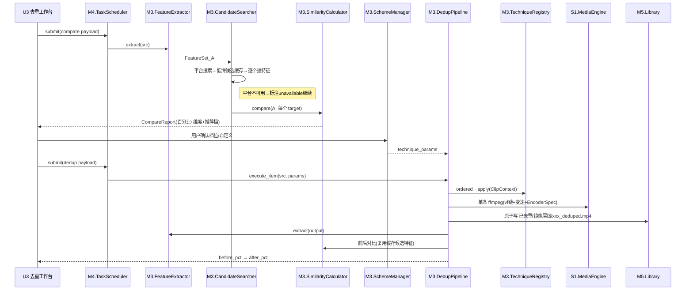
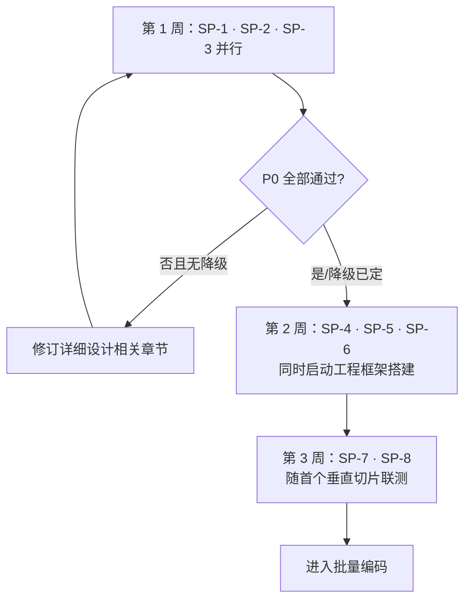

# 「源重构」详细设计文档

> 版本：v1.0
> 日期：2026-08-24
> 状态：待确认
> 设计依据：《源重构 - 需求文档》v2.0（`flag/flagone.md`）、《源重构 - 概要设计文档》v1.0（`design/general_design.md`）

---

## 目录

- 一、引言
- 二、全局设计约定
- 三、工程目录结构
- 四、公共数据结构与错误码体系
- 五、S5 基础服务 详细设计
- 六、S4 网络服务 详细设计
- 七、S3 数据持久化服务 详细设计（含完整 DDL）
- 八、S1 媒体引擎服务 详细设计
- 九、S2 AI 推理服务 详细设计（含模型选型）
- 十、M5 素材库管理模块 详细设计
- 十一、M4 任务调度中心 详细设计
- 十二、M1 素材采集模块 详细设计
- 十三、M2 视频预处理模块 详细设计
- 十四、M3 智能去重模块 详细设计（含完整算法与公式）
- 十五、U 表示层 简要设计
- 十六、端到端流程时序设计
- 十七、测试设计总纲
- 十八、遗留待确认事项与假设记录
- 十九、技术可行性验证（Spike）计划

---

## 一、引言

### 1.1 编写目的

本文档在概要设计确定的架构与模块边界之上，给出各模块的类级设计：类与方法签名、核心算法步骤与公式、数据库 DDL、时序图、错误码映射，以及每个模块的独立可测试性方案，作为编码实现的直接依据。

### 1.2 已确认的范围决策

以下决策已由需求方于 2026-08-24 确认：

| 决策项 | 结论 |
|--------|------|
| 文档粒度 | 完整类级设计（类图 + 方法签名 + 算法公式 + 时序图 + 错误码） |
| 表示层 | 简要包含（布局分区、控件清单、信号槽表；不做像素级 UI 规范） |
| 平台插件 | Pexels/Pixabay 完整详设；抖音/快手/B站/小红书/TikTok/YouTube 框架化（适配思路+风险+降级策略） |
| AI 模型 | 指定具体开源模型选型 |
| M3 算法 | 给出完整算法步骤、公式与初始参数值 |
| 数据库 | 给出完整建表 DDL 与迁移策略 |
| 工程结构 | 定义 Python 包目录树与文件命名约定 |
| 测试设计 | 每个模块章节末尾附"可独立测试性"小节 |
| 图表格式 | mermaid |
| 默认参数 | 重试 2 次；下载并发 3；首版 CPU 基准 |

### 1.3 阅读约定

- 本文所有代码块为**设计规格**（Python 类型注解伪代码），不是最终实现代码；
- 方法签名中 `-> None` 省略不写；`...` 表示方法体由实现阶段完成；
- 所有跨模块引用的数据类型定义集中在第四章「公共数据结构」；
- 错误码格式为 `<域><三位数字>`，全表见 4.3 节，各模块章节只列本模块码段。

---

## 二、全局设计约定

### 2.1 技术栈与版本基线

| 类别 | 选型 | 版本约束 | 备注 |
|------|------|----------|------|
| 语言 | Python | >= 3.10, < 3.13 | 使用 `X \| Y` 联合类型语法 |
| GUI | PySide6 | >= 6.6, < 7 | Qt 6.x API |
| 视频引擎 | FFmpeg / ffprobe | >= 5.1（随包分发） | 子进程调用，安装于 `runtime/` |
| 图像处理 | opencv-python-headless | >= 4.9 | 不引入 highgui，预览用 Qt 多媒体 |
| 推理 | onnxruntime | >= 1.17 | CPUExecutionProvider 为基准 |
| 数值计算 | numpy | >= 1.26 | |
| HTTP | requests | >= 2.31 | 同步模型，配合工作线程 |
| 凭据存储 | keyring | >= 24 | Windows 凭据管理器存 API Key |
| 打包 | PyInstaller + Inno Setup | - | |
| 测试 | pytest / pytest-qt / responses | - | 开发依赖 |

### 2.2 编码与命名约定

| 项 | 约定 |
|----|------|
| 包/模块名 | 全小写下划线：`m1_search.py` |
| 类名 | 大驼峰：`DownloadManager` |
| 私有成员 | 单下划线前缀 `_load_model()` |
| 路径 | 统一使用 `pathlib.Path`；对超过 240 字符的路径自动加 `\\?\` 前缀（Windows 长路径兼容，见 `common/fsutil.py`） |
| 时间字符串 | ISO 本地时间 `YYYY-MM-DD HH:MM:SS`（数据库）；日期目录 `YYYY-MM-DD` |
| 日志 logger 名 | `ych.s1` ~ `ych.s5`、`ych.m1` ~ `ych.m5`、`ych.ui` |
| 国际化 | 所有用户可见字符串经 `self.tr()` 包装，源语言为简体中文 |
| 注释语言 | 中文 |

### 2.3 线程与并发约定

| 规则编号 | 规则 |
|----------|------|
| T-1 | UI 主线程禁止任何磁盘 IO（>10ms）、网络调用、推理调用 |
| T-2 | 所有长任务以 `QRunnable` 提交至 M4 的 `QThreadPool` |
| T-3 | 跨线程通信仅用 Qt 信号（默认队列连接），信号参数必须是可拷贝对象（str/int/float/dataclass） |
| T-4 | 取消采用**协作式取消令牌** `CancellationToken`，工作循环每帧/每分片检查一次 |
| T-5 | SQLite 采用 thread-local 连接 + WAL 模式（详见第七章） |
| T-6 | FFmpeg 子进程 stdout/stderr 必须持续读出，防止管道缓冲区塞满导致死锁 |
| T-7 | 并发常量：下载并发默认 3（可配 1~8）；处理类任务并发默认 2（可配 1~4） |

### 2.4 关键默认参数总表

以下参数初值写入配置默认值，全部可在设置页或配置文件覆盖。标注"实测调整"者为首版上线前需用真实素材校准的项。

| 参数键 | 默认值 | 说明 | 来源 |
|--------|--------|------|------|
| `download_concurrency` | 3 | 下载并行数上限 | 需求 4.1 |
| `process_concurrency` | 2 | 预处理/去重/比对并行数 | 设计定值 |
| `max_retry` | 2 | 失败自动重试次数 | 概要十·4 |
| `retry_backoff_seconds` | [2, 8] | 第 1/2 次重试延迟（指数退避） | 设计定值 |
| `compare_candidates_per_platform` | 20 | 自动对比单平台候选拉取数 | 概要十·3，实测调整 |
| `candidate_cache_ttl_days` | 7 | 对比候选视频缓存保留天数 | 设计定值 |
| `feature_max_frames` | 300 | 特征提取单视频抽帧总数上限 | 设计定值 |
| `detect_sample_frames` | 24 | 水印/字幕检测抽样帧数上限 | 设计定值 |
| `inpaint_tile_size` | 512 | LaMa 修复 tile 尺寸 | 模型约束 |
| `dedup_weights` | (0.5, 0.25, 0.25) | 构图/运镜/节奏权重 | 设计定值，实测调整 |
| `net_probe_ttl_seconds` | 600 | 外网探测结果缓存时长 | 设计定值 |
| `foreign_platforms_enabled` | false | 国外平台总开关 | 需求 1.2 |
| `readonly_protect_raw` | true | 原始素材设为只读属性 | 设计定值 |
| `language` | zh_CN | 界面语言 | 需求 4.2 |
| `workdir` | 空（首启动引导设置） | 素材工作目录 | 需求 1.6 |
| `proxy_enabled` / `proxy_host` / `proxy_port` | false / "" / 0 | 代理设置 | 需求 U5 |
| `pexels_api_key` / `pixabay_api_key` | 空（keyring 加密存储） | 素材站密钥 | 概要 7.5 |

### 2.5 输出编码规范（全局唯一，封装于 S1）

所有转码输出统一执行：

```text
视频：libx264，preset=medium，crf=20，pix_fmt=yuv420p，保持原帧率（变速手法除外）
音频：aac，128kbps，44100Hz，立体声（去原声/无音轨时不写音频流）
封装：mp4，movflags=+faststart
```

---

## 三、工程目录结构

顶层 Python 包名为 **`ych`**（「源重构」拼音缩写）。如需改名属机械替换，不影响任何设计。

```
yuanchonggou/                        # 仓库根
├── pyproject.toml                   # 项目元数据与依赖声明
├── README.md
├── src/
│   └── ych/
│       ├── __init__.py              # 版本号 __version__
│       ├── app.py                   # 入口 main()：应用初始化、DI 组装、主窗口启动
│       ├── context.py               # AppContext：服务定位器，持有全部服务单例引用
│       ├── common/                  # 跨层公共件（无业务逻辑）
│       │   ├── errors.py            # AppError、错误码常量
│       │   ├── schemas.py           # 第四章全部 dataclass
│       │   ├── cancellation.py      # CancellationToken
│       │   └── fsutil.py            # 长路径、原子写、安全删除
│       ├── services/
│       │   ├── s5_base/
│       │   │   ├── config_service.py
│       │   │   ├── log_service.py
│       │   │   └── i18n_service.py
│       │   ├── s4_net/
│       │   │   ├── http_client.py
│       │   │   └── rate_limiter.py
│       │   ├── s3_db/
│       │   │   ├── database.py      # 连接管理、事务、迁移
│       │   │   ├── migrations.py    # DDL 脚本序列
│       │   │   └── daos.py          # 全部 DAO 类
│       │   ├── s1_media/
│       │   │   ├── ffmpeg_runner.py
│       │   │   ├── probe_service.py
│       │   │   ├── frame_extractor.py
│       │   │   └── encoder_spec.py
│       │   └── s2_ai/
│       │       ├── provider.py      # InferenceProvider 协议 + Detection/BBox 类型
│       │       ├── local_provider.py# LocalProvider 实现
│       │       ├── model_registry.py# ONNX 会话懒加载缓存
│       │       ├── postprocess.py   # NMS/BBox 合并/时域聚类（纯函数）
│       │       └── template_matcher.py # 固定角标模板匹配兜底
│       ├── core/
│       │   ├── m5_library/
│       │   │   ├── workdir_manager.py
│       │   │   ├── archive_service.py   # 三级归档 + 序号命名
│       │   │   ├── scan_indexer.py
│       │   │   └── category_service.py
│       │   ├── m4_scheduler/
│       │   │   ├── task_scheduler.py    # QObject，对外唯一入口
│       │   │   ├── task_worker.py       # QRunnable
│       │   │   ├── retry_controller.py
│       │   │   ├── fail_record_manager.py
│       │   │   └── crash_recovery.py
│       │   ├── m1_capture/
│       │   │   ├── plugin_base.py       # PlatformPlugin 抽象
│       │   │   ├── plugin_manager.py
│       │   │   ├── search_coordinator.py
│       │   │   ├── history_service.py
│       │   │   ├── result_filter.py
│       │   │   ├── download_manager.py
│       │   │   ├── net_checker.py
│       │   │   └── plugins/
│       │   │       ├── pexels_plugin.py     # 完整实现
│       │   │       ├── pixabay_plugin.py    # 完整实现
│       │   │       ├── douyin_plugin.py     # 框架占位
│       │   │       ├── kuaishou_plugin.py   # 框架占位
│       │   │       ├── bilibili_plugin.py   # 框架占位
│       │   │       ├── xiaohongshu_plugin.py# 框架占位
│       │   │       ├── tiktok_plugin.py     # 框架占位
│       │   │       └── youtube_plugin.py    # 框架占位
│       │   ├── m2_preprocess/
│       │   │   ├── preprocess_pipeline.py
│       │   │   ├── frame_level_processor.py  # 解码→检测→修复→编码 流式管线
│       │   │   ├── filter_only_processor.py  # 纯 ffmpeg 滤镜管线
│       │   │   ├── subtitle_handler.py
│       │   │   └── region_temporal.py        # 区域时域稳定（纯函数）
│       │   ├── m3_dedup/
│       │   │   ├── feature_extractor.py
│       │   │   ├── scene_detector.py
│       │   │   ├── motion_analyzer.py
│       │   │   ├── rhythm_analyzer.py
│       │   │   ├── similarity.py
│       │   │   ├── report_builder.py
│       │   │   ├── candidate_searcher.py
│       │   │   ├── candidate_cache.py
│       │   │   ├── scheme_manager.py
│       │   │   ├── dedup_pipeline.py
│       │   │   └── techniques/
│       │   │       ├── base.py             # DedupTechnique 抽象 + ParamSchema
│       │   │       ├── registry.py
│       │   │       ├── mirror.py
│       │   │       ├── crop_scale.py
│       │   │       ├── color_filter.py
│       │   │       ├── speed.py
│       │   │       └── border.py
│       │   └── interfaces.py               # 业务模块间服务接口协议（防反向依赖）
│       └── ui/
│           ├── u0_main/main_window.py, nav_panel.py
│           ├── u1_capture/capture_page.py, filter_panel.py, result_list.py, download_queue_view.py
│           ├── u2_preprocess/preprocess_page.py, asset_tree.py, option_panel.py, box_select_canvas.py
│           ├── u3_dedup/dedup_page.py, scheme_editor.py, report_view.py
│           ├── u4_failures/failure_page.py
│           ├── u5_settings/settings_page.py
│           └── u6_common/player_widget.py, progress_bar.py, empty_state.py, theme.qss, toast.py
├── runtime/                         # 打包资源（PyInstaller datas）
│   ├── ffmpeg.exe, ffprobe.exe
│   └── models/
│       ├── watermark_yolov8n_640.onnx
│       ├── subtitle_det_ppocrv4_mobile.onnx
│       ├── lama_fp32_512.onnx
│       └── clip_vitb32_image.onnx
├── templates/                       # 已知平台角标模板图（模板匹配兜底用）
├── i18n/                            # zh_CN.ts/en_US.ts → 编译 .qm
├── tests/
│   ├── unit/                        # 按 ych 包结构镜像
│   ├── integration/                 # 需要真实 ffmpeg 的慢速用例（pytest -m integration 标记）
│   └── fixtures/                    # 小样本视频（≤3s）、假 ffmpeg 脚本、样例 JSON
└── scripts/build_exe.spec           # PyInstaller 配置
```

---

## 四、公共数据结构与错误码体系

### 4.1 核心数据结构（`common/schemas.py`）

```python
from dataclasses import dataclass, field
import numpy as np
from typing import Literal

WatermarkTag = Literal["yes", "no", "unknown"]
TaskState = Literal["pending", "running", "success", "failed", "skipped", "interrupted"]
Region = Literal["cn", "global"]

@dataclass
class BBox:
    x: float; y: float; w: float; h: float   # 归一化坐标 0~1，原点左上

@dataclass
class VideoMeta:
    """平台插件搜索结果的标准结构（概要设计 5.1 的落地）"""
    plugin_id: str                # 如 "pexels"
    video_key: str                # 平台内唯一 id
    title: str = ""
    page_url: str = ""
    duration_s: float = 0.0
    width: int = 0
    height: int = 0
    file_size_bytes: int | None = None    # 平台未提供时为 None，筛选按"不限"
    watermark_tag: WatermarkTag = "unknown"
    download_url: str = ""        # 选定清晰度的直链
    thumbnail_url: str = ""
    extra: dict = field(default_factory=dict)

@dataclass
class SearchFilters:
    duration_min_s: float = 0.0
    duration_max_s: float = 36000.0
    min_height: int = 0                     # 0=原始画质不限；720/1080=要求≥该高度
    size_min_mb: float = 0.0
    size_max_mb: float = 1e9
    watermark: WatermarkTag = "unknown"     # unknown 即"不限制"

@dataclass
class ResumeState:
    downloaded_bytes: int = 0
    etag: str = ""
    total_bytes: int = 0
    temp_path: str = ""

@dataclass
class MediaInfo:
    path: str
    duration_s: float = 0.0
    width: int = 0; height: int = 0
    fps: float = 0.0
    vcodec: str = ""; acodec: str = ""
    has_audio: bool = False
    soft_subtitle_codec: str = ""           # 非 "" 即存在软字幕轨
    size_bytes: int = 0
    format_name: str = ""
    @property
    def is_supported(self) -> bool: ...      # 扩展名 ∈ {mp4,avi,mov,mkv,flv}

@dataclass
class ManualRegions:
    """U2 手动框选结果，归一化坐标"""
    rects: list[BBox] = field(default_factory=list)
    time_start_s: float = 0.0
    time_end_s: float = -1.0                # -1 表示到片尾

@dataclass
class FeatureSet:
    """M3 特征提取产物"""
    composition: np.ndarray        # (shot_count, 512) L2 归一化 CLIP 向量
    shot_mid_ts: list[float]       # 各镜头中点时刻
    motion_curve: np.ndarray       # (32, 3)，列=[pan_x, pan_y, zoom]，均归一化 [-1,1]
    rhythm_hist: np.ndarray        # (16,) 镜头时长 log 直方图，和为 1
    cut_rate_curve: np.ndarray     # (32,) 切换率曲线，归一化 [0,1]
    duration_s: float = 0.0
    version: str = "1"             # 特征版本号，版本不同则不可直接比对

@dataclass
class DimScores:
    composition: float; motion: float; rhythm: float; overall: float  # 均 ∈ [0,1]

@dataclass
class CompareTarget:
    source: Literal["auto", "manual"]
    platform_id: str = ""
    video_key: str = ""
    title: str = ""
    url: str = ""
    local_path: str = ""                    # manual 或已缓存候选时填写
    scores: DimScores | None = None
    status: Literal["ok", "skipped", "unavailable"] = "ok"
    status_reason: str = ""

@dataclass
class CompareReport:
    src_path: str
    overall_score: float                    # 0~100
    dims: DimScores
    weights: tuple[float, float, float]
    targets: list[CompareTarget]
    unavailable_platforms: list[str] = field(default_factory=list)
    created_at: str = ""

@dataclass
class TaskPayload:
    """M4 任务载荷。type 字段决定必填子字段，校验规则见十一章"""
    type: Literal["download", "preprocess", "dedup", "compare"]
    # download: metas=list[VideoMeta], keyword=str, limit=int
    # preprocess: items=list[{src, ops}], 
    # dedup: items=list[{src, scheme_id 或 technique_params}]
    # compare: srcs=list[path], mode=auto/manual/both, ref_paths=list[path]
    data: dict = field(default_factory=dict)
```

### 4.2 取消令牌与通用回调（`common/cancellation.py`）

```python
class CancellationToken:
    def cancel(self) -> None: ...
    @property
    def cancelled(self) -> bool: ...
    def check(self) -> None:   # 已取消时抛 TaskCanceled
        ...
class TaskCanceled(Exception): ...
class SkippedSignal(Exception):
    """批量 handler 内单条素材命中跳过条件（如目标已存在）时抛出，
    由 M4 worker 捕获并置该条为 skipped，不影响批内其余条目"""

ProgressFn = Callable[[float], None]        # 0.0~1.0
LineFn     = Callable[[str], None]         # ffmpeg stderr 行回调
```

### 4.3 全局错误码表（`common/errors.py`）

```python
class AppError(Exception):
    def __init__(self, code: str, message: str, cause: BaseException | None = None):
        ...   # message 为面向用户的中文文案；日志另记 cause 堆栈
```

| 域 | 码段 | 模块 | 主要错误码（摘要） |
|----|------|------|--------------------|
| NET | NET001~NET099 | S4/M1.5 | NET001 连接超时；NET002 DNS 失败；NET003 代理不可用；NET010 外网不可达 |
| PLG | PLG001~PLG199 | M1 插件 | PLG001 Key 缺失；PLG002 Key 无效(401/403)；PLG003 限频(429)；PLG010 平台不可达；PLG020 接口结构变更解析失败 |
| DL | DL001~DL099 | M1.3 | DL001 分块写入失败；DL002 校验失败；DL003 目标盘空间不足；DL010 达到单次上限(非错误，提示) |
| MED | MED001~MED099 | S1 | MED001 ffmpeg 未找到；MED002 ffprobe 解析失败；MED003 格式不支持；MED010 转码退出码非零；MED011 超时被杀 |
| AI | AI001~AI099 | S2 | AI001 模型文件缺失；AI002 模型加载失败；AI003 推理输入非法；AI004 推理超时 |
| DB | DB001~DB099 | S3 | DB001 打开失败；DB002 迁移失败；DB003 唯一约束冲突；DB004 磁盘 IO 错误 |
| TASK | TASK001~TASK099 | M4 | TASK001 任务不存在；TASK002 状态迁移非法；TASK003 重试超限；TASK004 用户取消 |
| FILE | FILE001~FILE099 | M5/common | FILE001 工作目录无效；FILE002 无写权限；FILE003 原子重命名失败；FILE004 只读保护冲突 |
| CFG | CFG001~CFG099 | S5 | CFG001 键不存在且有默认值缺失；CFG002 值反序列化失败 |

---

## 五、S5 基础服务 详细设计

### 5.1 职责与边界

配置读写、滚动日志、界面多语言。被所有模块依赖，自身不依赖任何业务模块。配置物理存储于 SQLite `app_settings` 表（随 S3），API Key 例外：存入系统凭据管理器（keyring），表中只存布尔标记。

### 5.2 类设计

```python
class ConfigService:
    _DEFAULTS: dict[str, object]            # 2.4 节参数表的唯一事实来源
    def get(self, key: str) -> object: ...              # 未设置返回默认值
    def get_typed(self, key: str, tp: type[T]) -> T: ...  # T = TypeVar，兼容 3.10
    def set(self, key: str, value: object) -> None: ... # 写库并发射 changed 信号
    def secret_get(self, key: str) -> str: ...          # keyring 读
    def secret_set(self, key: str, value: str) -> None: ...
    changed = Signal(str, object)           # (key, new_value)

class LogService:
    @staticmethod
    def setup(level: str = "INFO") -> None:
        ...   # RotatingFileHandler：logs/app.log，单文件 5MB × 5 个，
              # 格式 "%(asctime)s %(levelname)s %(name)s %(message)s"

class I18nService(QObject):
    locale_changed = Signal(str)
    def current_locale(self) -> str: ...
    def switch_locale(self, locale: str) -> None:
        ...   # "zh_CN"|"en_US"；卸载旧 QTranslator → 加载 i18n/<locale>.qm →
              # QCoreApplication.installTranslator → 发射 locale_changed
    def available_locales(self) -> list[str]: ...
```

### 5.3 关键设计点

1. `ConfigService` 在 SQLite 未就绪时（启动早期）退化为内存模式，`database_ready()` 后回填持久化——支撑"UI 先行展示 ≤5s"目标。
2. 日志脱敏：LogService 提供 `sanitize(msg)` 过滤 URL query 中的 `key=`/`token=` 参数值，HttpClient 记录请求日志时强制过 sanitize。
3. i18n 切换后需要重启才能完全生效的视图（如 QSS 内嵌文本）在切换弹窗中明确告知用户。

### 5.4 可独立测试性

| 测试点 | 方式 |
|--------|------|
| 默认值兜底 | 内存模式 ConfigService：get 未设置键 → 返回默认值 |
| set/get 往返 | 临时 sqlite 文件注入 |
| keyring 替身 | fixture 将 keyring 后端替换为内存字典实现 |
| i18n | 断言 switch 后 translator 文件存在并发出信号；用 tr() 样例串比对 qm 内容 |

---

## 六、S4 网络服务 详细设计

### 6.1 职责与边界

全应用唯一网络出口：会话管理、代理、超时、限速、请求级重试、流式下载断点续传。插件不得自建 session。

### 6.2 类设计

```python
class RateLimiter:
    """按 host 的令牌桶"""
    def acquire(self, host: str, timeout_s: float = 10.0) -> None: ...

class HttpClient(QObject):
    net_error = Signal(str, str)            # (code, message) 供全局错误提示

    def __init__(self, config: ConfigService): ...
    def _build_session(self) -> requests.Session:
        ...   # Retry(total=max_retry, backoff_factor=1.5,
              #      status_forcelist=(429,500,502,503,504),
              #      allowed_methods=("GET","HEAD"))
              # timeout=(连接 5s, 读 30s)；UA="YuanChongGou/<ver>"
              # proxy_enabled 时设置 session.proxies
    def get_json(self, url: str, params: dict = None,
                 headers: dict = None) -> dict | list: ...
    def head(self, url: str) -> requests.Response: ...
    def download_stream(self, url: str, dest: Path,
                        resume: ResumeState | None,
                        on_progress: ProgressFn | None,
                        token: CancellationToken | None) -> ResumeState:
        ...
    def probe_url(self, url: str, timeout_s: float = 5.0) -> Literal["ok", "dns_fail", "conn_fail"]:
        ...   # 三态探测：requests.exceptions.ConnectionError 且含 DNS 解析错误
              # → "dns_fail"；其余连接/TLS/超时失败 → "conn_fail"；
              # HEAD 失败退化 GET（range: bytes=0-0）；供 M1.5 使用
```

### 6.3 断点续传算法

```text
1. 若 resume 存在且 dest 临时文件存在：
     发送 Range: bytes={resume.downloaded_bytes}-
     服务端返回 206 且 ETag==resume.etag → 追加写，起点=downloaded_bytes
     否则（200/416/ETag 变化）→ 丢弃临时文件，从 0 开始
2. 无 resume → 普通 GET，创建 dest+".part" 临时文件
3. 循环 iter_content(chunk_size=256KB)：
     token.check()；写文件；downloaded_bytes += n
     每 ≥1s 或 ≥1MB 通过 on_progress 回调一次
4. 完成：fsync → 返回 ResumeState(downloaded_bytes=total)；
   由调用方（M1.3/M5）执行原子重命名
5. 中途取消/异常：保留 .part 与 ResumeState 供续传；ResumeState 由调用方持久化
```

不支持 Range 的响应（无 `Accept-Ranges`/206）：静默降级为整段重新下载，并在返回的 ResumeState 上置 `etag=""` 标记。

### 6.4 可独立测试性

- 用 `responses` 库 mock 206/200/416/ETag 变化四种场景，断言续传起点与临时文件内容；
- 限速器：注入假时钟，验证令牌发放节奏；
- 取消：chunk 回调内触发 cancel，断言抛 `TaskCanceled` 且 `.part` 保留。

---

## 七、S3 数据持久化服务 详细设计

### 7.1 职责与边界

SQLite 连接管理、建库迁移、DAO。上层只见 DAO 与 dataclass，不见 SQL。与概要设计第六章的差异：新增 `asset_index`、`keyword_category` 两张表（原因见 7.5 节偏差说明）。schema 版本号用 SQLite `PRAGMA user_version` 管理，不建独立表。

### 7.2 连接与并发模型

```text
- 库文件位置：<用户数据目录>/YuChongGou/app.db（%APPDATA%，不混入素材工作目录）
- PRAGMA journal_mode=WAL；PRAGMA foreign_keys=ON；PRAGMA busy_timeout=5000
- 每线程一个连接（threading.local），check_same_thread=False
- 写操作统一经 Database.write(fn) 串行锁包裹，避免 SQLITE_BUSY
- Database.open() 延迟调用：首次 DAO 访问时才建立连接（启动提速）
```

### 7.3 完整 DDL（`migrations.py` v1 脚本）

```sql
-- schema 版本：PRAGMA user_version = 1（不建版本表，避免双轨）
PRAGMA user_version = 1;

CREATE TABLE IF NOT EXISTS search_history (
    id          INTEGER PRIMARY KEY AUTOINCREMENT,
    keyword     TEXT NOT NULL,
    platform_ids TEXT NOT NULL DEFAULT '[]',        -- JSON 数组字符串
    created_at  TEXT NOT NULL DEFAULT (datetime('now','localtime'))
);
CREATE INDEX IF NOT EXISTS idx_sh_keyword ON search_history(keyword);
CREATE INDEX IF NOT EXISTS idx_sh_created ON search_history(created_at DESC);

CREATE TABLE IF NOT EXISTS download_task (
    id           INTEGER PRIMARY KEY AUTOINCREMENT,
    video_meta   TEXT NOT NULL,                     -- VideoMeta JSON
    status       TEXT NOT NULL DEFAULT 'pending'
                 CHECK(status IN ('pending','running','success','failed','skipped','interrupted')),
    progress     REAL NOT NULL DEFAULT 0,           -- 0.0~1.0
    dest_path    TEXT,
    resume_state TEXT,                              -- ResumeState JSON，NULL 表示无可续传状态
    keyword      TEXT NOT NULL,
    platform_id  TEXT NOT NULL,
    error_code   TEXT,
    created_at   TEXT NOT NULL DEFAULT (datetime('now','localtime')),
    updated_at   TEXT NOT NULL DEFAULT (datetime('now','localtime'))
);
CREATE INDEX IF NOT EXISTS idx_dt_status ON download_task(status);
CREATE INDEX IF NOT EXISTS idx_dt_kw ON download_task(keyword);

CREATE TABLE IF NOT EXISTS process_task (
    id            INTEGER PRIMARY KEY AUTOINCREMENT,
    task_type     TEXT NOT NULL CHECK(task_type IN ('preprocess','dedup','compare')),
    src_path      TEXT NOT NULL,
    dst_path      TEXT,
    status        TEXT NOT NULL DEFAULT 'pending'
                  CHECK(status IN ('pending','running','success','failed','skipped','interrupted')),
    retry_count   INTEGER NOT NULL DEFAULT 0,
    params        TEXT,                             -- TaskPayload.data JSON
    result_summary TEXT,                            -- 成功耗时/输出信息或失败详情 JSON
    error_code    TEXT,
    created_at    TEXT NOT NULL DEFAULT (datetime('now','localtime')),
    finished_at   TEXT
);
CREATE INDEX IF NOT EXISTS idx_pt_status ON process_task(status);
CREATE INDEX IF NOT EXISTS idx_pt_type_src ON process_task(task_type, src_path);

CREATE TABLE IF NOT EXISTS fail_record (
    id          INTEGER PRIMARY KEY AUTOINCREMENT,
    file_name   TEXT NOT NULL,
    fail_reason TEXT NOT NULL,                      -- 面向用户的中文描述
    error_code  TEXT,
    fail_time   TEXT NOT NULL DEFAULT (datetime('now','localtime')),
    task_type   TEXT NOT NULL CHECK(task_type IN ('download','preprocess','dedup','compare')),
    payload     TEXT NOT NULL                       -- 重建任务所需完整 JSON（需求：一键重新处理）
);
CREATE INDEX IF NOT EXISTS idx_fr_time ON fail_record(fail_time DESC);

CREATE TABLE IF NOT EXISTS dedup_scheme (
    id                INTEGER PRIMARY KEY AUTOINCREMENT,
    name              TEXT NOT NULL UNIQUE,
    techniques_config TEXT NOT NULL,                -- [{id, params}] JSON
    created_at        TEXT NOT NULL DEFAULT (datetime('now','localtime')),
    updated_at        TEXT NOT NULL DEFAULT (datetime('now','localtime'))
);

CREATE TABLE IF NOT EXISTS compare_report (
    id         INTEGER PRIMARY KEY AUTOINCREMENT,
    src_path   TEXT NOT NULL,
    report     TEXT NOT NULL,                       -- CompareReport JSON（含候选特征缓存键）
    created_at TEXT NOT NULL DEFAULT (datetime('now','localtime'))
);
CREATE INDEX IF NOT EXISTS idx_cr_src ON compare_report(src_path, created_at DESC);

CREATE TABLE IF NOT EXISTS app_settings (
    key   TEXT PRIMARY KEY,
    value TEXT NOT NULL                             -- JSON 序列化的任意标量/结构
);

-- ↓↓↓ 相对概要设计的补充表 ↓↓↓
CREATE TABLE IF NOT EXISTS asset_index (
    id         INTEGER PRIMARY KEY AUTOINCREMENT,
    path       TEXT NOT NULL UNIQUE,
    kind       TEXT NOT NULL CHECK(kind IN ('raw','cleaned','deduped')),
    size_bytes INTEGER,
    duration_s REAL,
    width      INTEGER,
    height     INTEGER,
    mtime      REAL,
    category   TEXT,                                -- 一级大类
    keyword    TEXT,                                -- 二级关键词
    date_str   TEXT,                                -- 三级日期 YYYY-MM-DD
    indexed_at TEXT NOT NULL DEFAULT (datetime('now','localtime'))
);
CREATE INDEX IF NOT EXISTS idx_ai_kind ON asset_index(kind);
CREATE INDEX IF NOT EXISTS idx_ai_cat_kw_date ON asset_index(category, keyword, date_str);

CREATE TABLE IF NOT EXISTS keyword_category (
    keyword    TEXT PRIMARY KEY,
    category   TEXT NOT NULL,
    updated_at TEXT NOT NULL DEFAULT (datetime('now','localtime'))
);
```

### 7.4 迁移机制

```python
class Database:
    SCHEMA_VERSION = 1
    def open(self) -> None: ...       # 打开 → PRAGMA → user_version 比较 → 逐版执行 migrations
    def write[T](self, fn: Callable[[sqlite3.Connection], T]) -> T: ...  # BEGIN IMMEDIATE..COMMIT
MIGRATIONS: list[tuple[int, str]] = [(1, DDL_V1)]   # 后续版本追加，永不修改历史脚本
```

### 7.5 DAO 接口（`daos.py`）

说明：各 DAO 返回的 `DownloadTaskRow`/`ProcessTaskRow`/`FailRecordRow`/`SchemeRow`/`AssetRow` 为与表列一一对应的冻结 dataclass，定义于 `daos.py` 头部（字段即 DDL 列名），此处不重复列出。

```python
class SettingsDao:
    def get(self, key: str) -> str | None: ...
    def set(self, key: str, value: str) -> None: ...
    def all(self) -> dict[str, str]: ...

class SearchHistoryDao:
    def add(self, keyword: str, platform_ids: list[str]) -> None: ...
    def distinct_keywords(self, limit: int = 20) -> list[tuple[str, str]]: ...  # (词, 最近时间)

class DownloadTaskDao:
    def create(self, meta: VideoMeta, keyword: str) -> int: ...
    def update_state(self, task_id: int, status: TaskState,
                     progress: float | None = None,
                     resume: ResumeState | None = None,
                     error_code: str | None = None) -> None: ...
    def get(self, task_id: int) -> DownloadTaskRow | None: ...
    def list_by_status(self, status: TaskState) -> list[DownloadTaskRow]: ...

class ProcessTaskDao:
    def create(self, task_type: str, src: Path, params: dict) -> int: ...
    def mark_running(self, task_id: int) -> None: ...       # 先写库再执行（T-规则）
    def finish(self, task_id: int, status: TaskState,
               summary: dict | None, error_code: str | None) -> None: ...
    def list_interrupted(self) -> list[ProcessTaskRow]: ... # 崩溃恢复扫描

class FailRecordDao:
    def add(self, file_name: str, reason: str, code: str,
            task_type: str, payload: dict) -> int: ...
    def list_recent(self, limit: int = 200) -> list[FailRecordRow]: ...
    def delete(self, record_id: int) -> None: ...

class SchemeDao:
    def save(self, name: str, config: list[dict]) -> int: ...   # upsert by name
    def load(self, name: str) -> list[dict] | None: ...
    def list_all(self) -> list[SchemeRow]: ...
    def delete(self, scheme_id: int) -> None: ...

class ReportDao:
    def add(self, src: Path, report: CompareReport) -> int: ...
    def latest_for(self, src: Path) -> CompareReport | None: ...

class AssetIndexDao:
    def upsert_many(self, rows: list[AssetRow]) -> None: ...
    def find_by_dir(self, dir_path: Path) -> list[AssetRow]: ...
    def count_named_like(self, pattern: str) -> int: ...        # 序号分配辅助
    def all_paths(self) -> set[str]: ...                        # 增量扫描差集

class CategoryDao:
    def map_keyword(self, keyword: str, category: str) -> None: ...
    def category_of(self, keyword: str) -> str | None: ...
    def rename_category(self, old: str, new: str) -> None: ...  # 事务内更新两表
    def merge_categories(self, src: str, dst: str) -> None: ...
```

### 7.6 可独立测试性

- 全部 DAO 用临时 sqlite 文件做往返/约束测试（CHECK、UNIQUE 冲突映射 DB003）；
- 迁移测试：v1 空库建表 → 断言 user_version 与表清单；
- 并发冒烟：4 线程同时 write，断言零异常（WAL+写锁）；
- 上层模块测试一律注入 `Database(":memory:")` 或 tmp 文件库，不 mock DAO。

---

## 八、S1 媒体引擎服务 详细设计

### 8.1 职责与边界

FFmpeg/ffprobe 子进程的唯一封装点：命令构建、执行、进度解析、媒体信息探测、抽帧、编码规范。上层不出现裸 `subprocess` 调用 ffmpeg 的代码。

### 8.2 类设计

```python
@dataclass(frozen=True)
class EncoderSpec:
    vcodec: str = "libx264"; crf: int = 20; preset: str = "medium"
    pix_fmt: str = "yuv420p"
    acodec: str | None = "aac"; abitrate_k: int = 128; asr: int = 44100
    movflags: str = "+faststart"
    def to_args(self, with_audio: bool) -> list[str]: ...

class FFmpegRunner:
    def locate_binaries(self) -> tuple[Path, Path]:
        ...   # 查找顺序：打包资源 runtime/ → 设置项 → PATH；找不到抛 MED001
    def run(self, args: list[str], timeout_s: float | None = None,
            on_line: LineFn | None = None,
            token: CancellationToken | None = None) -> int:
        ...   # 阻塞执行，stderr 逐行回调；超时/取消 kill 进程树(MED011/TASK004)
    def run_pipe(self, decode_args: list[str], encode_args: list[str],
                 frame_cb: Callable[[np.ndarray], np.ndarray],
                 total_frames: int, on_progress: ProgressFn,
                 token: CancellationToken) -> Path:
        ...   # 双子进程流式管线：decode→rawvideo pipe→frame_cb→pipe→encode
              # 见 8.4；返回输出路径由 encode_args 决定
    def parse_progress_line(self, line: str) -> float | None:
        ...   # 从 "time=00:01:23.45" 提取秒数；配合 MediaInfo.duration 换算进度

class ProbeService:
    def probe(self, path: Path) -> MediaInfo:
        ...   # ffprobe -v quiet -print_format json -show_format -show_streams
              # 解析失败/非媒体文件 → MED002；扩展名不在白名单 → MED003

class FrameExtractor:
    def uniform(self, path: Path, fps: float,
                max_frames: int, token=None) -> list[Frame]:
        ...   # Frame(ts: float, img: np.ndarray BGR)
              # fps 自适应：若 dur*fps > max_frames 则 fps = max_frames/dur
    def single(self, path: Path, ts: float) -> Frame: ...
    def stream_pairs(self, path: Path, fps: float, max_frames: int):
        ...   # 生成器逐帧产出，供光流的相邻帧对计算（避免整载内存）
```

### 8.3 ffprobe 字段映射

| MediaInfo 字段 | ffprobe 来源 |
|----------------|--------------|
| duration_s | format.duration |
| width/height/fps | video_stream.width/height/r_frame_rate（分数求值） |
| vcodec/acodec | codec_name |
| has_audio | 存在 audio 流 |
| soft_subtitle_codec | subtitle 流的 codec_name（subrip/ass/mov_text） |
| size_bytes | format.size |
| format_name | format.format_name |

### 8.4 帧级处理流式管线（run_pipe 核心机制）

```text
ffmpeg -i IN -vf fps=<f>,format=bgr24 -f rawvideo pipe:1   （解码进程 stdout）
   → Python 逐帧读取（w*h*3 字节/帧）→ frame_cb(frame) → 写入 stdin
ffmpeg -f rawvideo -pix_fmt bgr24 -s WxH -r FPS -i pipe:0
       <额外 -vf 滤镜链> <EncoderSpec 参数> -an? OUT.mp4        （编码进程 stdin）

内存占用恒定 ≈ 2 帧；进度 = 已回调帧数 / total_frames；
任一进程非零退出 → MED010（附 stderr 尾部 20 行）。
```

### 8.5 可独立测试性

- `fixtures/fake_ffmpeg/`：可执行的 python 假 ffmpeg/ffprobe 脚本，能输出固定 probe JSON、生成纯色 rawvideo——使单元测试无需真实二进制；
- 集成测试（标记 `integration`）：用 fixtures 下 3 秒小视频验证 run_pipe 端到端输出可被再次 probe；
- parse_progress_line 纯函数表驱动用例。

---

## 九、S2 AI 推理服务 详细设计

### 9.1 职责与边界

模型文件的懒加载与会话缓存、四类推理能力的统一出口、推理前后处理。M2/M3 只依赖 `InferenceProvider` 协议。GPU 仅预留 provider 扩展点，首版 CPU。

### 9.2 模型选型表

| 能力 | 模型 | 文件名 | 输入规格 | 输出规格 | 预估体积 |
|------|------|--------|----------|----------|----------|
| 水印检测 | YOLOv8n（logo/watermark 微调权重导出 ONNX） | `watermark_yolov8n_640.onnx` | 1×3×640×640 RGB，/255 归一化 | (1,N,6)：cx,cy,w,h,conf,cls | ~12MB |
| 字幕文本区域检测 | PaddleOCR PP-OCRv4 mobile det 导出 ONNX（中英文通用 DBNet） | `subtitle_det_ppocrv4_mobile.onnx` | 1×3×H×W（H,W 为 32 倍数，长边 ≤960） | 文本多边形顶点集 | ~4.7MB |
| 图像修复 | LaMa（big-lama）FP32 ONNX 导出 | `lama_fp32_512.onnx` | image 1×3×512×512 [-1,1]；mask 1×1×512×512 {0,1} | 1×3×512×512 修复图 | ~190MB（风险见十八章） |
| 关键帧特征 | OpenAI CLIP ViT-B/32 图像编码器 ONNX（FP16 导出，FP32 约 350MB 过大） | `clip_vitb32_image.onnx` | 1×3×224×224，CLIP mean/std 归一化 | (1,512) 向量，L2 归一化 | ~175MB（风险见十八章） |

兜底与降级：

1. 水印检测置信度 <0.45 或模型缺失时，启用 `TemplateMatcher`（OpenCV matchTemplate 多尺度匹配 `templates/` 下已知平台角标模板：抖音右下 Logo、B站水印等），命中阈值 0.8；
2. 任一模型加载失败：对应功能报 AI001/AI002，UI 引导改用手动框选模式（功能不崩溃）。

### 9.3 类设计

```python
@dataclass
class Detection:
    bbox: BBox                 # 映射回原分辨率后的归一化坐标
    confidence: float
    label: str                 # "watermark" | "subtitle"
    ts: float                  # 该帧时间戳

class InferenceProvider(Protocol):
    def detect_watermark(self, frames: list[Frame]) -> list[list[Detection]]: ...
    def detect_subtitle(self, frames: list[Frame]) -> list[list[Detection]]: ...
    def inpaint(self, frame: np.ndarray, mask: np.ndarray) -> np.ndarray: ...
    def embed_frames(self, frames: list[Frame]) -> np.ndarray:   # (n,512) L2 归一化
        ...

class ModelRegistry:
    def session(self, name: ModelName) -> ort.InferenceSession:
        ...   # 懒加载 + 缓存；so_options.intra_op_num_threads = 物理核-2（下限2）
              # providers=["CPUExecutionProvider"]（GPU 就绪时此处切换）

class LocalProvider(InferenceProvider):
    def __init__(self, registry: ModelRegistry, config: ConfigService): ...
    # detect_watermark：
    #   letterbox 到 640 → 推理 → conf>=0.45 → NMS(iou=0.45) → 反算原坐标
    #   结果不足且模板库可用 → TemplateMatcher 补充
    # detect_subtitle：
    #   长边缩放至 ≤960 → det 推理 → 多边形转最小外接矩形 → 合并重叠(IoU>0.3)
    # inpaint：
    #   mask 外扩 12%（高斯羽化 8px）→ 裁 patch（含 mask）resize 512 → LaMa →
    #   resize 回贴（羽化 alpha 混合）；patch<32px 小区域走 cv2.INPAINT_TELEA 快速通道
    # embed_frames：22×224 预处理 → 批推理（batch=16）→ L2 归一化

class TemplateMatcher:
    def match(self, frame: np.ndarray) -> list[Detection]: ...
        # templates/*.png 多尺度(0.5~1.5) matchTemplate(TM_CCOEFF_NORMED)
```

### 9.4 后处理纯函数（`postprocess.py`，重点单测对象）

```python
def nms(dets: list[Detection], iou_thr: float) -> list[Detection]: ...
def merge_boxes(dets: list[Detection], iou_thr: float) -> list[Detection]: ...
def expand_bbox(b: BBox, margin: float) -> BBox: ...          # 外扩并 clamp
def temporal_cluster(
    per_frame_dets: list[list[Detection]], frame_ts: list[float],
    iou_link: float = 0.5, presence_ratio: float = 0.6,
) -> list[RegionSpan]:
    """
    时域聚类：跨帧 IoU>0.5 链接成簇；簇在其活跃时间段内出现率 ≥60%
    才认定为静态区域。返回 RegionSpan(bbox, t_start, t_end)，
    供 M2 只对激活时段帧做修复（性能关键）。
    """
def stabilize_regions(spans: list[RegionSpan],
                      fps: float) -> list[RegionSpan]: ...
    # 相邻 RegionSpan 时间间隔 < 2s 且 IoU>0.5 → 合并延展，消除闪烁断档
```

### 9.5 性能预算

| 操作 | CPU 目标（1080p 帧） | 依据 |
|------|---------------------|------|
| YOLOv8n 640 | ≤60ms | onnxruntime CPU 4 线程典型值 |
| OCR det mobile | ≤80ms | |
| LaMa 512 tile | ≤400ms/tile；静态水印区域首帧结果缓存复用（每 30 帧刷新一次） | 修复只在遮罩局部进行（概要 7.1） |
| CLIP 224 | ≤30ms/帧 | batch 16 |

### 9.6 可独立测试性

- `DummyProvider`：确定性替身（返回预设 BBox、inpaint 返回原图+固定色块、embed 返回哈希向量），M2/M3 全部单测基于它；
- postprocess 全部纯函数：构造合成 Detection 列表表驱动测试；
- LocalProvider 集成用例：对 fixtures 提供的带水印小视频跑通检测→修复，人工核对输出图（标记 integration）。

---

## 十、M5 素材库管理模块 详细设计

### 10.1 职责与边界

工作目录生命周期、三级归档与命名、素材扫描索引、原子写入与只读保护。是 M1/M2/M3 的落盘后端，自身不发起任何网络/推理调用。

### 10.2 类设计

```python
class WorkDirManager(QObject):
    workdir_changed = Signal(Path)
    def validate(self, path: Path) -> AppError | None:
        ...   # 必须存在/可写/非系统关键目录；失败返回 FILE001/FILE002
    def ensure_layout(self) -> None: ...          # 创建 已去重/ 根目录
    def workdir(self) -> Path: ...

class ArchiveService:
    def archive_download(self, meta: VideoMeta, temp_file: Path,
                         keyword: str, token=None) -> Path:
        ...   # 下载产物归档：分类目录 → 序号命名 → 原子移动 → 只读保护 →
              # 更新 asset_index；返回最终路径
    def next_filename(self, platform: str, keyword: str,
                      date_str: str, ext: str = ".mp4") -> tuple[Path, str]:
        ...   # 命名 平台_关键词_序号.ext；序号 = max(磁盘现有, asset_index 计数)+1，
              # 三位零填充；仍冲突则递增（FILE 安全兜底）
    def mirror_path_for_output(self, src: Path, suffix: str,
                               out_root: Path | None = None) -> Path:
        ...   # out_root=None → cleaned 输出（同目录加后缀）；
              # out_root=已去重/ → 镜像 src 相对工作目录的层级再加后缀

class CategoryService:
    def resolve_category(self, keyword: str) -> str:
        ...   # 查 keyword_category 表；未命中 → 新建映射（大类=关键词本身）
    def rename_category(self, old: str, new: str) -> None: ...
    def merge(self, src: str, dst: str) -> None: ...
        # 物理搬移目录树 + 两表更新，同一事务语义：先搬移成功再更新库

class ScanIndexer(QObject):
    scan_finished = Signal(int)                   # 本次新增条数
    def incremental_scan(self) -> None:
        ...   # os.walk 工作目录 *.mp4 → 与 all_paths() 差集 → 新文件 ffprobe
              # （懒：仅取时长分辨率）→ upsert；path 不存在的行删除；
              # 全程在工作线程（由调用方经 M4 提交）
    def classify_kind(self, name: str, rel_dir: str) -> Literal["raw","cleaned","deduped"]:
        ...   # 名称含 _cleaned → cleaned；位于 已去重/ 下或含 _deduped → deduped；否则 raw

class SafeFileOps:                                # 薄静态工具，common/fsutil 承接
    @staticmethod
    def atomic_write(target: Path, writer: Callable[[Path], None]) -> None:
        ...   # target.with_suffix(target.suffix + ".part.tmp") 写完 fsync →
              # os.replace（同卷原子）→ 失败清理残留
    @staticmethod
    def protect_readonly(path: Path, readonly: bool) -> None:
        ...   # Windows 只读属性：os.chmod(stat.S_IREAD / S_IWRITE)
```

### 10.3 归档流程（下载完成 → 落盘）

```text
temp_file(.part 已完成) 
→ resolve_category(keyword) 得大类 C
→ 目录 = workdir/C/keyword/YYYY-MM-DD/（逐级创建）
→ next_filename(platform, keyword, date) 
→ SafeFileOps.atomic_write：os.replace(temp, final)
→ protect_readonly(final, True)   （config.readonly_protect_raw）
→ asset_index.upsert(raw 行)
→ 返回 final 路径给 M1.3 → M1.3 经信号通知 UI
```

### 10.4 可独立测试性

- 归档命名：tmp 工作目录 + 内存库，验证三级路径、序号连续性、同名冲突递增；
- mirror_path：给定深层嵌套源路径断言镜像输出路径；
- atomic_write：writer 中途抛异常 → 断言无半成品、target 未变；
- ScanIndexer：预置目录树（raw/cleaned/deduped 混合）断言 kind 分类与增量行为。

---

## 十一、M4 任务调度中心 详细设计

### 11.1 职责与边界

所有长任务的统一入口与编排者：队列、并发控制、状态机、重试、失败记录、崩溃恢复。M1/M2/M3 以「处理器回调」形式注册进调度器（`register_handler(type, fn)`），从而互相解耦。

### 11.2 状态机



### 11.3 类设计

```python
@dataclass
class ManagedTask:
    task_id: str                 # uuid4 hex
    payload: TaskPayload
    state: TaskState = "pending"
    retry_count: int = 0
    db_row_id: int | None = None # download_task/process_task 表行 id
    token: CancellationToken = field(default_factory=CancellationToken)

@dataclass
class TaskResult:
    """handler 执行体统一返回值"""
    summary: dict = field(default_factory=dict)   # 写入 result_summary
    output_path: str | None = None

@dataclass
class CrashRecoverySummary:
    resumed_downloads: int = 0     # 已重新入队续传的下载任务数
    moved_to_fail: int = 0         # 转入失败列表的中断任务数

class TaskScheduler(QObject):
    task_submitted = Signal(str)                    # task_id
    task_state = Signal(str, str, str)              # task_id, state, message
    task_progress = Signal(str, float)              # task_id, 0~1
    queue_stats = Signal(int, int)                  # done, total（批量进度条）

    def __init__(self, pool: QThreadPool, config: ConfigService,
                 db_daos: DaosBundle): ...
    def register_handler(self, task_type: str,
                         handler: Callable[[ManagedTask], TaskResult]) -> None:
        ...   # M1/M2/M3 启动时注册各自执行体
    def submit(self, payload: TaskPayload, priority: int = 0) -> str:
        ...   # 建 ManagedTask + 落库(pending) → 入优先队列 → 尝试派发
    def cancel(self, task_id: str) -> None: ...     # token.cancel()，TASK004
    def submit_from_fail_record(self, record_id: int) -> str:
        ...   # 读 payload 重建任务（U4 一键重新处理入口）
    def recover_on_startup(self) -> CrashRecoverySummary: ...

class TaskWorker(QRunnable):
    def __init__(self, scheduler: TaskScheduler, task: ManagedTask): ...
    def run(self) -> None:
        # 1. dao.mark_running（先写库后执行，T-规则）
        # 2. handler(task) —— 内部自行限流：
        #    download 型 → 先获取 DownloadManager.semaphore(3)
        #    其余型 → ProcessSemaphore(2) 在派发处控制
        # 3. 成功 → dao.finish(success, summary)；发信号
        # 4. TaskCanceled → finish(canceled)
        # 5. 其他异常 → RetryController 决策（见下）
        # finally: 派发下一任务 + queue_stats 刷新

class RetryController:
    def should_retry(self, task: ManagedTask, err: Exception) -> bool:
        ...   # AppError 且 code ∈ 可重试集合(NET*, DL001/002, MED010, AI004, PLG003)
              # 且 retry_count < config.max_retry
    def backoff_seconds(self, retry_index: int) -> int:  # [2, 8][i]
        ...

class FailRecordManager:
    def record(self, task: ManagedTask, err: Exception) -> None:
        ...   # file_name 取 payload 源文件名/meta.title；payload 存全量重建信息
    def requeue(self, record_id: int) -> str: ...

class CrashRecovery:
    def scan(self) -> CrashRecoverySummary:
        ...   # SELECT download_task WHERE status='running' → 置 interrupted →
              #   有 resume_state → 重建 pending 任务（续传）
              # SELECT process_task WHERE status='running' → interrupted →
              #   写 fail_record("软件中断，请重新处理")
              # 返回汇总供 UI 启动提示
```

### 11.4 批量任务与部分失败

批量提交 = N 条独立 ManagedTask 共享同一 `batch_id`（放入 payload.data）。`queue_stats` 按 batch 聚合。任意一条终态失败不影响其余条目（异常仅在 worker 内捕获，不逃逸出 `run()`）。

### 11.5 可独立测试性

- 用 `SyncFakeHandler`（立即成功/抛错/挂起可控）驱动调度器，断言状态机全迁移路径与信号序列；
- 重试：handler 前 N 次失败第 N+1 次成功 → 最终 success 且 retry_count 正确；
- 崩溃恢复：手工把库中行置 running → recover_on_startup → 断言 interrupted/续传分支；
- 取消：挂起 handler 内 cancel → TASK004 终态。

---

## 十二、M1 素材采集模块 详细设计

### 12.1 插件框架（扩展点一落地）

#### 12.1.1 插件契约

```python
class PlatformPlugin(ABC):
    id: str; display_name: str; region: Region
    requires_api_key: bool = False
    enabled_by_default: bool = False

    def check_available(self) -> tuple[bool, str]: ...
        # (可达?, 原因)。实现必须走 S4，超时 ≤5s，不得抛异常
    def search(self, keyword: str, filters: SearchFilters,
               max_count: int, token: CancellationToken) -> list[VideoMeta]: ...
    def pick_download_variant(self, variants: list[dict],
                              filters: SearchFilters) -> dict | None:
        ...   # 从平台提供的多清晰度候选中选择满足 filters 的最优项（默认实现按
              # 高度≥min_height 的最小体积优先）
    def download(self, meta: VideoMeta, dest_part: Path,
                 on_progress: ProgressFn, resume: ResumeState | None,
                 token: CancellationToken) -> ResumeState:
        ...   # 默认实现 = http_client.download_stream(meta.download_url,...)
```

#### 12.1.2 PluginManager

```python
class PluginManager:
    def discover(self) -> None:
        ...   # 扫描 ych.core.m1_capture.plugins 包内 *_plugin.py，
              # 收集 PlatformPlugin 子类实例化；记录版本
    def by_region(self) -> dict[Region, list[PlatformPlugin]]: ...
    def enabled(self, region: Region) -> list[PlatformPlugin]:
        ...   # 结合 settings.enabled_plugins(JSON) 与 foreign_platforms_enabled 总开关
    def availability(self, plugin) -> tuple[bool, str]: ...
        ...   # 带 ttl 缓存包装 check_available（复用 M1.5 结果）
```

#### 12.1.3 Pexels 插件（完整详设）

| 项 | 规格 |
|----|------|
| id / region / key | `pexels` / global / 需要（设置页填写，keyring 存储） |
| 可用性检查 | GET `https://api.pexels.com/videos/search?query=test&per_page=1`，Header `Authorization: <key>`；HTTP 200 → 可用；401/403 → PLG002；超时 → PLG010 |
| 搜索 | GET `https://api.pexels.com/videos/search`，params：`query`, `per_page=min(max_count,80)`, `page=1`；响应 `videos[]` 字段映射：`id→video_key`, `url→page_url`, `duration`, `width/height`(取最高规格), `image→thumbnail_url` |
| 清晰度选择 | `video_files[]` 过滤 `file_type=="video/mp4"` → pick_download_variant；选定项 `link→download_url`、`file_size→file_size_bytes` |
| 水印标记 | 官方素材无第三方水印 → 恒 `watermark_tag="no"` |
| 下载 | 标准 GET 直链，支持 Range（走 S4 默认实现） |
| 限频 | 免费档约 200 次/小时 → RateLimiter host 配额 1 req/18s；命中 429 → PLG003（可重试） |
| 筛选语义 | `min_height`: pexels 无服务端过滤，本地过滤；`watermark` 筛选恒通过（no） |

#### 12.1.4 Pixabay 插件（完整详设）

| 项 | 规格 |
|----|------|
| id / region / key | `pixabay` / global / 需要 |
| 可用性检查 | GET `https://pixabay.com/api/videos/?key=<k>&q=test&per_page=3`；200 且含 `hits` → 可用；400 含 "invalid key" → PLG002 |
| 搜索 | 同上端点；`hits[]` 映射：`id`, `duration`, `views` 等；缩略图由 `picture_id` 拼 `https://i.vimeocdn.com/video/<picture_id>_640.jpg` |
| 清晰度选择 | `videos` 字典键 `large/medium/small/tiny`（各含 url,width,height,size）展开为 variant 列表 → pick_download_variant；注意 tiny 常为 gif，须按扩展名过滤 |
| 下载 | videos 字典内直链 GET |
| 限频 | 官方配额随档位变化且可能调整，设计按保守 host 配额 1 req/2s；实际值由 SP-6 实测后回填本行 |

#### 12.1.5 国内平台与 TikTok/YouTube（框架化说明）

六个插件首版交付**统一骨架**：继承 PlatformPlugin，`search/download` 抛 `AppError("PLG010", "该平台暂未开放采集，敬请期待后续版本")`，`check_available` 返回 `(False, "not_implemented")`。UI 据此将该平台显示为灰色"暂不可用"，不阻塞其他平台（符合需求风险对策）。

各平台适配思路备忘（供后续版本实现，不构成首版承诺）：

| 平台 | 思路 | 主要风险 |
|------|------|----------|
| 抖音 | 网页端搜索接口逆向 + 无水印直链解析 | X-Bogus/msToken 签名频繁变更 |
| 快手 | 网页端 GraphQL 接口 | Cookie/风控 |
| B站 | 官方开放 API（search/video info）+ 播放地址接口 | 需处理清晰度权限与 Referer 防盗链 |
| 小红书 | 网页笔记视频解析 | 强风控、登录态 |
| TikTok | 网页 embed/oembed 相关公开端点 | 区域封锁、签名 |
| YouTube | yt-dlp 引擎集成（作为可选依赖） | 频繁失效需跟进上游更新 |

验收口径（后续实现时）：能用其当时可用的公开/网页接口稳定返回 ≥10 条搜索结果并完成下载即达标；无法达成则维持"暂不可用"降级。

### 12.2 搜索协调与筛选

```python
class SearchCoordinator:
    search_finished = Signal(object)      # SearchResultSet
    search_failed  = Signal(str, str)     # keyword, message

    def search_multi(self, keywords: list[str], filters: SearchFilters,
                     per_platform_limit: int = 30, token=None) -> None:
        ...   # 异步（经 M4 或独立 worker）：
              # for kw in keywords: for p in plugin_manager.enabled(region):
              #     可用性缓存不可用 → 记入 result.unavailable_platforms
              #     p.search(...) 异常捕获单平台隔离（PLG 域错误）
              # 结果合并 → ResultFilter.apply → history.add(kw, platforms)
              # → 发射 search_finished

@dataclass
class SearchResultSet:
    keyword: str
    items: list[VideoMeta]
    unavailable_platforms: list[tuple[str, str]]   # (plugin_id, 原因)

class HistoryService:
    """历史搜索词：SearchCoordinator 写入、U1 下拉框读取的薄封装"""
    def record(self, keyword: str, platform_ids: list[str]) -> None: ...
    def suggestions(self, prefix: str = "", limit: int = 20) -> list[str]: ...

class ResultFilter:
    def apply(self, items: list[VideoMeta], f: SearchFilters) -> list[VideoMeta]:
        ...   # 时长区间闭开；min_height：height>=f.min_height（0 不过滤）；
              # 大小上下限（None 视为不限）；watermark：f=="yes" 只留 yes，
              # =="no" 只留 no，=="unknown"（不限）全留；
              # 排序：分辨率降序 → 时长升序（稳定展示）
```

### 12.3 下载队列（M1.3）

```python
class DownloadManager(QObject):
    semaphore: BoundedSemaphore            # 初值 = config.download_concurrency(3)
    item_updated = Signal(int, str, float, str)  # row_id, state, progress, msg

    def enqueue_downloads(self, metas: list[VideoMeta], keyword: str,
                          limit: int) -> int:
        ...   # 截取前 limit 条 → 每条 create download_task 行(pending) →
              # 组装单个 TaskPayload(type=download, batch) → M4.submit
              # 返回实际入队数；limit 生效即停止并入队提示任务（DL010）
    def handle_one(self, task: ManagedTask) -> TaskResult:
        ...   # semaphore.acquire()（实现 ≥3 并行的真正闸门）
              # resume = dao.resume_state or None
              # temp = M5.workdir/.downloading/<uuid>.part（跨平台隐藏目录）
              # plugin.download(...) → ArchiveService.archive_download(...)
              # 进度节流回写 dao.update_state(progress)（≥1s 间隔）
              # finally: semaphore.release()
```

### 12.4 外网能力检测（M1.5）

```python
class NetStatus(Enum): OK; BLOCKED; OFFLINE

class ForeignNetChecker:
    PROBE_URLS = ["https://www.pexels.com", "https://www.pixabay.com",
                  "https://www.tiktok.com"]
    def check(self, force: bool = False) -> NetStatus:
        ...   # 缓存 TTL=config.net_probe_ttl_seconds
              # 依次 probe_url（S4，5s 超时，代理生效），结果三态映射：
              #   任一 "ok" → OK；
              #   全部 "dns_fail" → OFFLINE（无网络）；
              #   混有 "conn_fail" → BLOCKED（有网但目标不可达，典型为被墙）
              # 结果与时间戳写入 app_settings（跨重启可见）
```

UI 行为：国外分区开关打开时若 `BLOCKED/OFFLINE` → 弹窗「当前网络环境无法访问外网素材站，请检查代理设置」，开关回弹。

### 12.5 模块间关系图



### 12.6 可独立测试性

| 对象 | 替身策略 |
|------|----------|
| Pexels/Pixabay 插件 | `responses` mock 官方响应 JSON 样例（fixtures/pexels_search.json 等）；覆盖 200/401/429/超时四分支 |
| 插件骨架 | 断言六平台 search 抛 PLG010 且 check_available=(False,"not_implemented") |
| SearchCoordinator | 注入 FakePluginManager（2 假插件，其一抛错）→ 断言隔离性与 unavailable 列表 |
| ResultFilter | 纯函数表驱动 |
| DownloadManager | FakePlugin（本地 file:// 或 responses 流）+ tmp 工作目录，验证 limit、并发闸门（计时断言 ≥2 批次）、断点续传（中断后续传字节数） |
| ForeignNetChecker | 注入 FakeHttpClient 探测结果矩阵 |

---

## 十三、M2 视频预处理模块 详细设计

### 13.1 处理项（Ops）定义

```python
@dataclass
class PreprocessOps:
    remove_watermark_mode: Literal["off", "auto", "manual"] = "off"
    watermark_regions: ManualRegions | None = None       # manual 时有效
    remove_subtitle_mode: Literal["off", "auto", "manual"] = "off"
    subtitle_regions: ManualRegions | None = None
    crop_rect: BBox | None = None                        # 裁剪（归一化）
    aspect_target: tuple[int, int] | None = None         # 如 (9,16)
    aspect_strategy: Literal["crop", "pad"] = "crop"     # 裁切 or 黑边
    strip_audio: bool = False
```

流水线组装判定（性能关键，保证 ≤2×时长）：

```text
need_frame_pass = 去水印≠off 或 去字幕∈{auto硬字幕, manual}
need_transcode  = crop_rect 或 aspect_target 或 need_frame_pass
only_soft_strip = 去字幕==auto 且 probe.soft_subtitle_codec!="" 且其余全 off
                 → ffmpeg -i in -map 0:v -map 0:a? -sn -c copy out（秒级完成）
纯滤镜路径      = not need_frame_pass and need_transcode
                 → 单条 ffmpeg：-vf chain(crop,scale,pad) -an? 编码
帧级路径        = need_frame_pass → run_pipe 流水线（8.4 节），
                 crop/scale/pad 滤镜挂在编码端 -vf，一次转码完成全部
```

### 13.2 类设计

```python
class PreprocessPipeline:
    def execute_item(self, src: Path, ops: PreprocessOps,
                     on_progress: ProgressFn, token: CancellationToken) -> Path:
        ...   # 1. probe → MED003 校验
              # 2. out = M5.mirror_path_for_output(src, suffix="_cleaned")
              # 3. 已存在 → raise SkippedSignal（M4 转 skipped）
              # 4. 按 13.1 判定路径分派
              # 5. SafeFileOps 原子收尾；返回 out

class FilterOnlyProcessor:
    def build_vf_chain(self, ops, probe) -> str:
        ...   # crop=w:h:x:y → scale → pad（aspect_strategy）；
              # 纯数学拼装，纯函数可测

class SubtitleHandler:
    def route(self, probe: MediaInfo, mode: str) -> Literal["soft","hard"]:
        ...   # mode==auto 且有软字幕轨 → soft（剥离）；
              # auto 无软轨但 OCR 抽样(≤6帧)检出底部文字带 → hard；
              # 都没有 → 返回 "none"（该项跳过不报错）

class FrameLevelProcessor:
    def process(self, src: Path, ops: PreprocessOps, probe: MediaInfo,
                out: Path, on_progress: ProgressFn,
                token: CancellationToken) -> None:
        ...   # 阶段A 检测：FrameExtractor.uniform(fps≈2, cap=detect_sample_frames)
              #   → Provider.detect_watermark / detect_subtitle
              #   → postprocess.temporal_cluster + stabilize_regions
              #   → List[RegionSpan]；manual 模式直接用 ManualRegions 构造
              #     RegionSpan(t_start,t_end=全程)
              # 阶段B 流式修复：ffmpeg_runner.run_pipe(
              #   frame_cb=_repair_frame, encode -vf=crop/scale/pad, -an?)
              #   _repair_frame(f):
              #     ts = 当前帧时间
              #     for span in spans where span covers ts:
              #       mask = span.bbox → 像素掩码
              #       if span.is_static and span.cache_valid: 贴缓存结果
              #       else: provider.inpaint(f, mask)；静态区域每 30 帧刷新缓存
              # 阶段C 耗时守卫：elapsed > 2×dur 时记 WARN 日志（不中断）

class RegionTemporal:      # 9.4 temporal_cluster 的 M2 侧薄封装 + 单测宿主
    ...
```

### 13.3 批量执行入口

```python
def make_preprocess_payload(items: list[tuple[Path, PreprocessOps]]) -> TaskPayload:
    return TaskPayload(type="preprocess",
                       data={"items": [{"src": str(p), "ops": asdict(o)} ...]})
# M2 注册的 handler：for each item → pipeline.execute_item
# 单条异常：捕获 AppError → FailRecordManager.record → continue（部分失败隔离）
```

### 13.4 结果语义

| 结果 | 触发条件 |
|------|----------|
| success | out 原子落盘且 ffprobe 可读 |
| skipped | `_cleaned` 已存在；软/硬字幕均未检出且仅勾选了去字幕 |
| failed | MED/AI/FILE 域错误，重试超限后入失败列表 |

### 13.5 可独立测试性

- build_vf_chain：参数矩阵表驱动（比例组合 × 策略），断言滤镜串；
- SubtitleHandler.route：构造 probe 变体 + DummyProvider 文本检出开关；
- FrameLevelProcessor：DummyProvider 返回固定中部 BBox → 用假 ffmpeg（fixtures）跑 run_pipe → 输出帧中部像素被替换色块，断言遮罩生效与时域缓存命中计数；
- only_soft_strip：fixtures 带字幕轨 mkv → 输出无 subtitle 流且时长不变；
- 性能冒烟（integration）：30s 视频 ≤60s 完成帧级路径。

---

## 十四、M3 智能去重模块 详细设计

### 14.1 特征提取（M3.1）

#### 14.1.1 总流程

```text
extract(path):
  1. probe → dur
  2. frames = FrameExtractor.stream_pairs(fps=2, cap=300)   # 自适应 fps=dur/cap
  3. boundaries = SceneDetector.split(frames)               # 镜头切分
  4. composition  = CompositionEmbedder.embed(frames, boundaries)   # CLIP
     motion_curve   = MotionAnalyzer.analyze(相邻帧对流)
     rhythm_hist, cut_rate = RhythmAnalyzer.compute(boundaries, dur)
  5. FeatureSet(version="1")
```

#### 14.1.2 镜头切分（SceneDetector）

对相邻抽样帧 t-1→t：

```text
d_t = Σ_c Σ_bin |Hist_t(c,bin) − Hist_{t−1}(c,bin)| / N_pixels
      其中 Hist 为 HSV 三通道各 32-bin 联合统计（cv2.calcHist H,S,V 分别 32bin 后串联）
自适应阈值：T = μ(d) + 2.5·σ(d)
镜头边界条件：d_t > T 且 d_t 为邻域(±3帧)极大值 且 距上一边界 ≥ 0.8s（最短镜头）
输出 boundaries = [t1 < t2 < … < tm]；镜头 k 区间 = (t_{k−1}, t_k]，t0=0, tm+1=dur
```

#### 14.1.3 运镜轨迹特征（MotionAnalyzer）

相邻抽样帧对 (F_{t−1}, F_t)：

```text
flow = cv2.calcOpticalFlowFarneback(F_{t−1}, F_t, None,
        pyr_scale=0.5, levels=3, winsize=15, iterations=3,
        poly_n=5, poly_sigma=1.2, flags=0)
网格采样步长 16px 取点对 (src_pts, dst_pts)
M, _ = cv2.estimateAffinePartial2D(src_pts, dst_pts, RANSAC)   # 相似变换
pan_x = M[0,2]/W ; pan_y = M[1,2]/H ; zoom = s − 1 ，s = √(det(M[:2,:2]))
→ 每帧对三元组 (pan_x, pan_y, zoom)
时间轴重采样：线性插值到固定长度 L=32 → motion_curve ∈ R^{32×3}
逐列 clip 到 [-1,1]（极端运动截断）
```

#### 14.1.4 剪辑节奏特征（RhythmAnalyzer）

```text
镜头时长序列 len_k = t_{k} − t_{k−1}
节奏直方图：对 len 取 log2 分箱，bins = [0,0.5,1,2,4,8,16,32,64,128,∞) 共 10 档
  → 归一化为概率分布 hist（和=1）；不足 10 维右侧补零至 16 维存储（预留）
切换率曲线：滑窗 w=5s、步长 w/6，cut_rate_i = 窗内边界数 / w
  → 曲线线性插值到 32 点 → 除以全局最大值归一到 [0,1]
```

#### 14.1.5 构图特征（CompositionEmbedder）

```text
每镜头 k 取其中点时刻最近帧 → LocalProvider.embed_frames → v_k ∈ R^512（L2 归一化）
composition = 矩阵堆叠 [v_1;…;v_m]；镜头数 m>32 时均匀下采样子集至 32
```

### 14.2 相似度计算（M3.2）

设待测 A、候选 B 的 FeatureSet，权重 `(w_c, w_m, w_r)` 默认 `(0.5, 0.25, 0.25)`：

```text
构图相似度（双向 Chamfer 最大匹配，容忍镜头顺序差异）：
  S_comp(A,B) = ½ · ( mean_i max_j cos(a_i, b_j) + mean_j max_i cos(a_i, b_j) )
  cos 为余弦相似度；任一方无镜头（空视频）→ 记 0 并标注 skipped_reason

运镜相似度：
  S_motion = 1 − ½ · mean(|A.motion_curve − B.motion_curve|)
  （两曲线元素均在 [-1,1]，故距离均值除以 2 归一到 [0,1]）

节奏相似度：
  S_hist  = Σ_i min(hist_A[i], hist_B[i])            # 直方图交，∈[0,1]
  S_rate  = 1 − mean(|A.cut_rate − B.cut_rate|)      # cut_rate ∈[0,1]，L1 均值 ∈[0,1]
  S_rhythm = 0.5 · S_hist + 0.5 · S_rate

值域自检（实现须单测覆盖边界）：三分量均 ∈ [0,1]；
  motion_curve 元素域 [-1,1] → 最大 L1 均值为 2 → S_motion 除以 2 归一；
  cut_rate 元素域 [0,1] → 最大 L1 均值为 1 → S_rate 不再除以 2。

综合重复度：
  Score = clip(w_c·S_comp + w_m·S_motion + w_r·S_rhythm, 0, 1)
  百分比 = round(Score × 100)
档位推荐：Score < 0.50 → 轻度；0.50 ≤ Score ≤ 0.80 → 中度；Score > 0.80 → 重度
```

```python
class SimilarityCalculator:
    def compare(self, a: FeatureSet, b: FeatureSet,
                weights: tuple[float,float,float]) -> DimScores: ...
        # a.version != b.version → raise AI003（特征版本不兼容）

class ReportBuilder:
    def build(self, src: Path, targets: list[CompareTarget],
              weights) -> CompareReport: ...
        # overall_score = max over targets（"与 N 个视频相似度超过 80%" 的 N =
        # count(scores.overall ≥ 0.80)）；排序 targets 降序；ReportDao.add
```

### 14.3 自动搜索对比（M3.3）

```python
class CandidateSearcher:
    def run(self, src: Path, mode: str, ref_paths: list[Path],
            on_progress: ProgressFn, token) -> CompareReport:
        ...   # feat_A = FeatureExtractor.extract(src)
              # refs = ref_paths（manual 部分）→ 逐一提特征
              # auto 部分：
              #   keyword = 从归档路径解析二级关键词（非归档素材要求用户填）
              #   for p in compare_plugins(enabled):
              #     p.check_available() False → targets += unavailable（整体不阻塞）
              #     else: p.search(kw, filters=宽筛(≤90s), K=20)
              #       → 每条 pick 低清变体(高度≤480 最接近者)
              #       → CandidateCache.fetch_or_download(meta)
              #       → extract 特征（单条预算 60s，超时 skip 该候选）
              #   全部平台不可用 → 报告 unavailable_platforms 非空 + 提示手动兜底
              # scores → ReportBuilder.build → ReportDao

class CandidateCache:
    root = <用户数据目录>/compare_cache/<plugin_id>/<video_key>.mp4
    def fetch_or_download(self, meta, token) -> Path: ...   # TTL 清理惰性执行
```

### 14.4 手法引擎（M3.5）

#### 14.4.1 手法契约与注册表

```python
@dataclass
class ParamField:
    key: str; label_zh: str
    type: Literal["int","float","enum","bool","color"]
    default: object
    range: tuple[float,float] | None = None
    choices: list[str] | None = None
ParamSchema = list[ParamField]

@dataclass
class ClipContext:
    src: Path
    probe: MediaInfo
    vf_filters: list[str] = field(default_factory=list)   # 累积 ffmpeg 滤镜
    speed_factor: float = 1.0                             # 变速特殊标记
    keep_audio: bool = True

class DedupTechnique(ABC):
    id: str; display_name_zh: str; zorder: int    # 执行顺序：mirror10<crop20<color30<speed40<border50
    param_schema: ParamSchema
    def validate_params(cls, params: dict) -> dict: ...   # clamp+缺省补全
    def apply(self, ctx: ClipContext, params: dict) -> ClipContext: ...

class TechniqueRegistry:
    def register(self, t: DedupTechnique) -> None: ...    # id 去重
    def ordered(self, ids: list[str]) -> list[DedupTechnique]: ...  # 按 zorder
ALL = [MirrorTechnique, CropScaleTechnique, ColorFilterTechnique,
       SpeedTechnique, BorderTechnique]                  # app 启动注册
```

#### 14.4.2 五种手法的参数与滤镜映射

| 手法 id | 参数 Schema | ffmpeg 实现（追加到 -vf） | 备注 |
|---------|-------------|---------------------------|------|
| `mirror` z=10 | axis: enum{horizontal, vertical, both} | hflip / vflip / hflip,vflip | |
| `crop_scale` z=20 | mode: enum{crop, scale}; margin_pct: float 0.02~0.25 | 设 W,H = probe 原始宽高（具体数值，非滤镜内表达式）。crop 模式：`crop=trunc(W*(1-2m)/2)*2:trunc(H*(1-2m)/2)*2:(iw-ow)/2:(ih-oh)/2,scale=W:H`（裁后必须显式 scale 回 W:H——滤镜内 iw/ih 已是裁剪后尺寸，写 iw:ih 是恒等操作）；scale 模式：`scale=trunc(W*(1+m)/2)*2:-2,crop=W:H:(iw-ow)/2:(ih-oh)/2`（放大后居中裁回原分辨率） | 保证输出分辨率不变；偶数对齐防 x264 报错 |
| `color_filter` z=30 | brightness −0.2~0.2; contrast 0.8~1.3; saturation 0.6~1.6; temperature −1~1; preset: enum{none,warm,cool,film} | eq=brightness=b:contrast=c:saturation=s + colorbalance=rm=t:gm=0:bm=-t（temperature t∈[-1,1]）+ presets→lut3d 内置 .cube | preset 与数值参数互斥应用 |
| `speed` z=40 | factor: float 0.75~1.25; scope: enum{global}(首版仅全局) | setpts=PTS/{f}；音频存在时 atempo={f}（0.75~1.25 在 atempo 单段范围内） | 影响 dur 与进度换算 |
| `border` z=50 | width_pct: float 0.02~0.08; style: enum{solid, blur}; color: enum{black,white,#RRGGBB} | solid→pad=iw+2b:ih+2b:b:b:color；blur→split[a][b];[b]scale=iw+2b:ih+2b,gblur=sigma=20[bg];[bg][a]overlay=b:b（模糊边框取画面自身放大模糊垫底） | border 放大总画幅 |

### 14.5 策略管理（M3.6）

```python
PRESETS: dict[str, PresetDef] = {
  "light": {label:"轻度去重", score_range:(0,0.5),
            techniques:[("crop_scale",{margin_pct:(0.04,0.06)}),
                        ("color_filter",{brightness:(-0.05,0.05)})]},
  "mid":   {score_range:(0.5,0.8),
            techniques:[("mirror",{}),
                        ("crop_scale",{margin_pct:(0.08,0.12)}),
                        ("color_filter",{contrast:(1.05,1.15)})]},
  "heavy": {score_range:(0.8,1.01),
            techniques:[("mirror",{}),
                        ("crop_scale",{margin_pct:(0.12,0.18)}),
                        ("color_filter",{saturation:(0.85,1.35)}),
                        ("speed",{factor:(0.92,1.10)}),
                        ("border",{width_pct:(0.02,0.04)})]},
}
class SchemeManager:
    def recommend(self, score: float) -> str: ...        # PRESETS 区间映射
    def instantiate(self, preset_id: str, seed: int | None = None) -> list[dict]:
        ...   # 区间内均匀随机取参（seed 可复现）；返回 [{id, params}]
    def save_custom(self, name: str, config: list[dict]) -> int: ...
    def load_custom(self, name: str) -> list[dict]: ...
    def preset_to_custom(self, preset_id, seed) -> list[dict]:
        ...   # 支撑需求："先用预设生成版本，再切换自定义微调"
```

### 14.6 去重流水线（M3.7）

```python
class DedupPipeline:
    def execute_item(self, src: Path, technique_params: list[dict],
                     on_progress: ProgressFn, token) -> DedupItemResult:
        ...   # 1. out = M5.mirror_path_for_output(src, "_deduped",
              #                                    out_root=workdir/"已去重")
              #    已存在 → SkippedSignal
              # 2. ctx = ClipContext(src, probe)；registry.ordered → 依序 apply
              # 3. 单条 ffmpeg：-i src -vf <join(ctx.vf_filters)>
              #    [setpts/atempo 由 speed_factor 注入] -an?(strip_audio=False 保留)
              #    EncoderSpec → SafeFileOps 原子写出
              # 4. 前后重复度对比：
              #    feat_before = 本次 compare_report 缓存（CandidateCache 特征或
              #    手动 refs 特征，ReportDao.latest_for(src)）
              #    feat_after = FeatureExtractor.extract(out)
              #    after_score = SimilarityCalculator 对同一批 targets 重算
              #    → DedupItemResult(before_pct, after_pct, out)
              # 5. 耗时守卫 > 3×dur → WARN
```

### 14.7 可独立测试性

| 对象 | 方式 |
|------|------|
| SceneDetector/RhythmAnalyzer/MotionAnalyzer | 合成帧序列（纯色跳变=切镜；平移棋盘格=已知 pan）→ 断言边界位置与曲线方向，纯 numpy/cv 可离线跑 |
| SimilarityCalculator | 构造已知向量集验证三公式数值（手算期望值表驱动）；version 不一致抛错 |
| 五种 Technique | validate/apply 纯函数：断言生成的滤镜串与参数 clamp |
| SchemeManager | recommend 边界值（0.49/0.50/0.80/0.81）；seed 复现一致性 |
| DedupPipeline | DummyProvider + 假 ffmpeg：输出文件生成、_deduped 命名、镜像层级、before/after 字段存在 |
| CandidateSearcher | FakePluginManager：1 平台正常 + 1 平台 check_available False → 断言报告 unavailable 标注且整体成功 |

---

## 十五、U 表示层 简要设计

### 15.1 页面流转



### 15.2 各页面要点

| 页面 | 布局分区 | 关键控件 | 关键信号槽（控件 → 业务入口） |
|------|----------|----------|-------------------------------|
| U1 采集 | 顶部关键词栏 / 左侧平台分区开关组 / 筛选面板（折叠）/ 中部结果列表 / 底部下载队列视图 | QLineEdit(多关键词逗号分隔)、QComboBox(历史词)、QCheckBox×平台、筛选四件套、QListView(缩略图卡)、QProgressBar 队列 | `search_btn.clicked → SearchCoordinator.search_multi`；`platform_toggle.toggled → settings+ForeignNetChecker`；`download_btn.clicked → DownloadManager.enqueue_downloads`；`scheduler.task_progress → 队列行刷新` |
| U2 预处理 | 左侧素材树(QTreeView，来源 M5 索引)/ 右上处理项面板 / 右中框选画布 / 右下结果列表 | 勾选三态、五处理项开关、BoxSelectCanvas(橡皮筋多区域)、预览按钮 | `tree.itemCheckStateChanged → 汇总勾选集`；`start_btn → make_preprocess_payload → M4.submit`；`canvas.region_added → ManualRegions` |
| U3 去重 | 左侧素材勾选列表 / 右侧方案区(三档卡片+自定义编辑器) / 底部报告视图 | 三档 QRadioButton(推荐档徽标)、SchemeEditor(动态渲染 param_schema)、ReportView(总分环+维度条+相似列表) | `analyze_btn → CandidateSearcher(compare 任务)`；`scheme_selected → SchemeManager`；`start_dedup_btn → DedupPipeline(dedup 任务)`；`report_ready → ReportView.render` |
| U4 失败列表 | QTableView(文件名/原因/时间/类型) + 「重新处理」「清除」按钮 | | `reprocess_btn → FailRecordManager.requeue` |
| U5 设置 | 表单分组：通用/网络/密钥/高级 | 语言下拉、工作目录选择、并发 SpinBox、Key QLineEdit(password)、代理三件套、「检测外网」按钮 | 控件 ↔ ConfigService 双向绑定（`changed` 信号回填） |
| U6 公共组件 | - | PlayerWidget(QMediaPlayer)、Toast(右上浮出提示)、EmptyState、统一 QSS 主题(浅/深跟随系统) | Toast 用于 DL010 上限提示、平台不可用提示等非阻断反馈 |

### 15.3 易用性与 i18n 落点

- 主要操作三步约束：采集（输词→搜→下）、预处理（勾素材→选项→开始）、去重（选素材→选方案→开始）；
- 全部按钮文案走 tr()；zh_CN.ts 为源语言，en_US.ts 翻译；lrelease 产物随包分发；
- 错误提示规范：Toast 显示 AppError.message + 「查看日志」按钮（打开 logs 目录）。

### 15.4 可独立测试性

pytest-qt：每页面冒烟用例（构造→显示→模拟点击→断言信号发出）；业务层全部经 FakeScheduler 注入，UI 测试不触网不碰 ffmpeg。

---

## 十六、端到端流程时序设计

### 16.1 流程 A：搜索与下载



### 16.2 流程 B：预处理



### 16.3 流程 C：智能去重



---

## 十七、测试设计总纲

### 17.1 分层策略

| 层级 | 范围 | 依赖真实度 | 执行频率 |
|------|------|-----------|----------|
| 单元 | services/core 全部纯函数与小类（postprocess、filter 链、相似度公式、命名、状态机） | 全替身 | 每次提交 |
| 组件 | 单个业务模块闭环（如 DownloadManager+FakePlugin+tmp 目录） | 半真（真 DB/FS） | 每次提交 |
| 集成 | S1+S2 真实 ffmpeg/模型小样本端到端 | 全真 | 夜间/发版前，`-m integration` |
| UI 冒烟 | pytest-qt 页面构造与交互信号 | FakeScheduler | 每次提交 |

### 17.2 统一替身组件清单

| 替身 | 位置 | 用途 |
|------|------|------|
| fake ffmpeg / ffprobe | tests/fixtures/fake_ffmpeg/ | 输出固定 probe JSON / 生成纯色 rawvideo / 可脚本化失败 |
| DummyInferenceProvider | tests/unit/s2_ai/dummies.py | 确定性检测/修复/嵌入 |
| FakeHttpClient + responses | conftest | 网络 mock（206 续传等） |
| MemoryConfigService / keyring 内存后端 | conftest | 配置与凭据 |
| SyncFakeHandler | unit/m4 | 可编程成败/挂起的任务处理器 |
| TempWorkdir fixture | conftest | 隔离的工作目录 + :memory: 数据库 |

### 17.3 覆盖率目标

services ≥80%；core ≥75%；关键算法模块（similarity/postprocess/scene/motion/rhythm）≥90%。CI 建议 GitHub Actions windows-latest，integration job 单独触发。

---

## 十八、遗留待确认事项与假设记录

### 18.1 待确认事项（沿承概要设计十章，补充新项）

| 编号 | 事项 | 现状/建议 |
|------|------|-----------|
| 1 | 开源协议 MIT / Apache 2.0 | 不阻塞开发 |
| 2 | 水印检测 YOLO 权重来源 | 需确认可用的开源 logo/watermark 权重；若无，则首版水印自动检测以 TemplateMatcher（已知平台角标模板）为主、YOLO 为增强。**由 SP-2 验证关闭** |
| 3 | LaMa ONNX 约 190MB，影响安装包体积 | 建议：基础包不含修复模型，首启按需下载；或换用轻量修复模型（效果折损需评估）。**由 SP-3 验证关闭** |
| 4 | `compare_candidates_per_platform`=20 与单候选 60s 预算 | 初值，需真实环境实测校准。**由 SP-1/SP-4 实测后回填 2.4 节参数表** |
| 5 | 六个国内/国外平台的接口可行性 | 滚动确认，维持降级框架不阻塞 |
| 6 | GPU 加速 | 首版 CPU 基准（已按此设计） |

### 18.2 本文做出的设计假设（如有异议请指出）

1. 顶层包名 `ych`、数据库名 `app.db`、缓存目录 `<用户数据目录>/compare_cache/` 等命名均为建议值，可整体替换；
2. 大类归纳规则：新关键词未映射时，**大类暂等于关键词本身**，由用户后续手动归并（需求未规定自动归纳算法）；
3. 原始素材只读保护通过 Windows 文件只读属性实现，用户可在设置关闭；
4. 变速手法首版仅支持全局变速（局部变速列入后续版本）；
5. 去重前后对比的"对比基准"沿用本次比对报告中的候选/手动参考集（缓存特征复用），而非重新联网比对；
6. 比对平台与采集平台共用插件体系，但对比场景忽略小红书（需求 3.1 对比平台列表未含小红书）。

---

## 十九、技术可行性验证（Spike）计划

### 19.1 目的与执行原则

本文档的性能预算（预处理 ≤2×时长、去重 ≤3×时长、启动 ≤5s）与 AI 模型选型建立在**典型值估算**之上。为把可行性风险在正式编码前关闭，设立本章 Spike 计划：

| 原则编号 | 内容 |
|----------|------|
| K-1 | 每个 Spike 必须有**量化通过标准**与**不通过时的降级决策**，二者在设计阶段即确定，不允许事后放宽 |
| K-2 | Spike 结论必须**回填本文档**对应章节（2.4 参数表 / 9.2 选型表 / 18.1 遗留事项），回填完成该风险项才算关闭 |
| K-3 | Spike 代码存放于 `tests/spikes/` 或独立分支，禁止直接演化为生产代码；可复用的部分以正式单测重写 |
| K-4 | 全部 P0 级 Spike 通过后，才进入批量编码；任一 P0 失败且无降级方案 → 返回修订详细设计 |
| K-5 | 结论统一记录于 `design/spike_results.md`，格式见 19.5 |

### 19.2 Spike 清单总览

| 编号 | 名称 | 验证的假设 | 关联章节 | 预计工时 | 优先级 |
|------|------|-----------|---------|---------|--------|
| SP-1 | 帧级修复闭环性能 | CPU 上"检测→修复→回写"满足预处理 ≤2×时长 | 8.4 / 9.5 / 13.2 / 2.4 | 2~3 天 | **P0** |
| SP-2 | 水印检测权重选型 | 存在可用的开源 logo/watermark 检测权重 | 9.2 / 18.1-2 | 2 天 | **P0** |
| SP-3 | LaMa ONNX 化与分发策略 | big-lama 可导出 ONNX 且体积/速度可接受 | 9.2 / 18.1-3 / 八·打包 | 1~2 天 | **P0** |
| SP-4 | 特征提取链路耗时与区分度 | 特征提取+相似度计算满足 ≤3×时长且有判别力 | 14.1 / 14.2 | 1 天 | P1 |
| SP-5 | 硬字幕检测效果 | PP-OCRv4 det 对中英文硬字幕带召回达标 | 9.2 / 13.2 | 1 天 | P1 |
| SP-6 | 素材站 API 实测 | Pexels/Pixabay 字段映射与限频和设计一致 | 12.1.3 / 12.1.4 | 0.5 天 | P1 |
| SP-7 | 并发与 GIL 冒烟 | 下载≥3 并行+处理 2 并行时 UI 响应 ≤1s | 2.3 / 十一 | 1 天 | P1 |
| SP-8 | 打包与冷启动 | PyInstaller 方案可行、启动 ≤5s 达标 | 三 / 5.1 | 1 天 | P2 |

### 19.3 各 Spike 详细规格

#### SP-1 帧级修复闭环性能（P0）

| 项 | 内容 |
|----|------|
| 输入素材 | 3 条真实解压类视频（1080p）：30s 静态角标水印、60s 移动文字水印、120s 无水印对照各 1 条 |
| 环境 | 目标最低配基准机：4 核 CPU / 8GB 内存 / SSD（无独显） |
| 步骤 | ① ffmpeg 抽帧(2fps)计时；② YOLOv8n 640 单帧推理计时 ×100 帧；③ LaMa 512 tile 修复计时 ×20 次；④ 开启/关闭"静态区每 30 帧刷新缓存"对比端到端耗时；⑤ run_pipe 回写编码并 ffprobe 校验输出可读 |
| 度量 | detect_ms/帧、inpaint_ms/tile、端到端总耗时 ÷ 原视频时长 = R |
| 通过标准 | 静态水印场景 R ≤ 2.0；移动水印场景 R ≤ 2.5 |
| 不通过降级 | a) 降低 `detect_sample_frames`（24→12）；b) 修复仅作用于关键帧、中间帧用时域传播填充；c) UI 对移动水印场景提示"建议手动框选模式"；d) 以上仍不达标 → 修订 M2 设计为"检测一次 + 整段遮罩恒定"简化模型 |
| 回填动作 | 更新 2.4 表实测列、9.5 性能预算表加"实测值"列 |

#### SP-2 水印检测权重选型（P0）

| 项 | 内容 |
|----|------|
| 候选清单 | a) 社区开源 logo/logo-det YOLO 权重；b) 基于 Watermark 检测公开数据集对 yolov8n 快速微调（≤4h 训练）；c) 仅 TemplateMatcher |
| 步骤 | ① 收集 ≥50 张多平台截图样本（抖音/B站/快手角标、画面任意位置文字水印）并人工标注 BBox；② 逐候选评估 mAP@0.5 与逐帧误检数；③ 与 TemplateMatcher（多尺度 matchTemplate）命中率对照 |
| 通过标准 | 固定位置水印召回 ≥90% 且平均每帧误检 ≤0.1 个；任意位置水印召回 ≥70% |
| 不通过降级 | 无合格权重 → 首版自动检测以 TemplateMatcher 为主（覆盖已知平台角标），YOLO 列入后续版本路线图；同步修改 U2 文案："自动识别支持常见平台角标，任意位置水印请使用手动框选"，并修订 9.2 表 |
| 回填动作 | 关闭或改写 18.1-2；更新 9.2 兜底策略行 |

#### SP-3 LaMa ONNX 化与分发策略（P0）

| 项 | 内容 |
|----|------|
| 步骤 | ① big-lama PyTorch → ONNX 导出（fp32/fp16 各试，静态 512 输入）；② 512 tile 单次推理耗时（复用 SP-1 环境）；③ 测算全量包/基础包体积；④ 草拟"首启按需下载"流程（URL、校验、断点续传走 S4.download_stream） |
| 通过标准 | fp32 导出成功且单 tile ≤600ms；按需下载流程端到端走通且校验失败可重下 |
| 不通过降级 | 导出失败或过慢 → 评估轻量替代模型（MI-GAN、LaMa small distill），替换后**重走 SP-1 计时**；仍不行 → 去水印自动修复降级为 OpenCV INPAINT_TELEA（效果打折，UI 明示"基础修复"） |
| 回填动作 | 关闭 18.1-3；确定九章模型表最终体积；决定安装包是否拆分 |

#### SP-4 特征提取链路耗时与区分度（P1）

| 项 | 内容 |
|----|------|
| 步骤 | ① CLIP ViT-B/32 视觉塔 ONNX 导出与单帧耗时；② 30s 视频全链路计时（切分+光流+嵌入+比对）；③ 准备 20 对视频（10 对同源翻拍/搬运、10 对同题材异源），用 14.2 公式计算得分并人工核对方向 |
| 通过标准 | 30s 视频全链路 ≤45s（≤1.5×，给去重主流程留出余量）；20 对样本方向正确率 ≥17/20 |
| 不通过降级 | 耗时超标 → 降 `feature_max_frames`(300→150)、光流改稀疏网格(32px)；区分度不足 → 权重重调或构图特征换 CLIP ViT-B/16 |
| 回填动作 | 2.4 参数表、14.x 公式参数（k=2.5、L=32 等）确认或修订 |

#### SP-5 硬字幕检测效果（P1）

| 项 | 内容 |
|----|------|
| 步骤 | PP-OCRv4 det mobile ONNX 化；中英文硬字幕样本各 ≥30 帧（含片尾滚动字幕负样本 10 帧）；统计底部字幕带召回（检出框与真实带 IoU>0.3 即命中） |
| 通过标准 | 中文召回 ≥85%，英文召回 ≥75%；负样本误检率 ≤10% |
| 不通过降级 | 英文差 → 换 server 级 det 模型（体积换效果）；整体差 → 自动去字幕仅做"软字幕剥离"，硬字幕引导手动框选 |
| 回填动作 | 9.2 模型表、13.2 SubtitleHandler.route 的判定阈值 |

#### SP-6 素材站 API 实测（P1）

| 项 | 内容 |
|----|------|
| 步骤 | ① 申请真实 Pexels/Pixabay Key；② 按 12.1.3/12.1.4 的请求规格逐条调用（搜索、分页、直链下载 Range 续传）；③ 抓取响应头中的限频字段（X-Ratelimit-* 等）与实际字段结构核对文档 |
| 通过标准 | 搜索+下载直链跑通；文档字段映射表零偏差；限频实测值记录归档 |
| 不通过处理 | 属文档修订而非技术风险：按实际响应修订 12.1 两张规格表与 RateLimiter host 配额 |
| 回填动作 | 12.1.3/12.1.4 表格限频行、2.4 参数表 |

#### SP-7 并发与 GIL 冒烟（P1）

| 项 | 内容 |
|----|------|
| 步骤 | 最小工程：PySide6 空主窗 + QThreadPool + 3 路 ffmpeg 转码子进程（真二进制、fixtures 小视频）+ 2 路纯 Python 假任务；任务管理器观测 CPU/内存/句柄；并行满载时人工连点 UI 计时响应 |
| 通过标准 | 满载时按钮点击视觉响应 ≤1s；连续运行 30min 无句柄泄漏（ffmpeg 进程全部回收）、无死锁 |
| 不通过降级 | 响应超标 → 处理类任务升级为子进程池（概要设计九章风险预案）；句柄泄漏 → 排查 run_pipe 进程树 kill 路径 |
| 回填动作 | 2.3 T-7 并发常量确认；十一章 worker 实现注意事项补充 |

#### SP-8 打包与冷启动（P2）

| 项 | 内容 |
|----|------|
| 步骤 | PyInstaller spec 草案产出两版：全量包（含 4 模型）与基础包（无模型）；干净 Win10 虚拟机上冷启动计时 ×5 取均值（SSD/HDD 各测）；验证 runtime/ 二进制定位与 keyring 在未登录新用户下的行为 |
| 通过标准 | 冷启动 ≤5s（HDD 放宽至 8s，需在 README 标注）；基础包体积 ≤150MB |
| 不通过降级 | 启动超时 → 进一步延迟非关键 import（matplotlib 类重依赖排查）、首帧后再初始化导航页；体积超标的模型走 SP-3 分包方案 |
| 回填动作 | 三章目录树注释（各产物体积）、十八章分发描述 |

### 19.4 执行顺序与放行门槛



- SP-1/SP-2/SP-3 构成**放行门槛**：三者共同决定 M2 去水印能力的最终形态（全自动/半自动/基础修复三档）；
- SP-4~SP-6 可与框架开发并行，结论只影响参数与文案；
- 所有回填完成后，`design/spike_results.md` 中每个条目状态须为「通过」或「已降级」，18.1 对应事项标记关闭。

### 19.5 结论记录模板（`design/spike_results.md`）

```markdown
| 编号 | 结论日期 | 环境(CPU/内存/盘) | 关键实测值 | 结论(通过/降级/失败) | 降级决策 | 文档回填章节 | 执行人 |
|------|----------|-------------------|-----------|---------------------|----------|--------------|--------|
| SP-1 | | | detect=__ms/tile=__ms/R=__ | | | 2.4, 9.5 | |
```

---

*文档结束*
